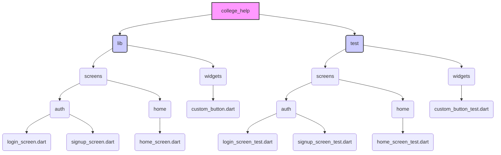

# Contributing to New College UofT App

Thank you for your interest in contributing to the New College UofT mobile application! This document provides guidelines and instructions for contributing to make the process smooth and effective.

## 🌟 Code of Conduct

By participating in this project, you agree to abide by our Code of Conduct:

- Be respectful and inclusive
- Provide constructive feedback
- Focus on what is best for the community
- Show empathy towards other community members

## 🔄 Development Workflow

### 1. Setting Up the Development Environment

1. **Fork the Repository**
   - Click the "Fork" button at the top-right of the repository page.

2. **Clone Your Fork**
   ```bash
   git clone https://github.com/YOUR_USERNAME/college_help.git
   cd college_help
   ```

3. **Add Upstream Remote**
   ```bash
   git remote add upstream https://github.com/ORIGINAL_OWNER/college_help.git
   ```

4. **Install Dependencies**
   ```bash
   flutter pub get
   ```

### 2. Making Changes

1. **Create a Branch**
   ```bash
   git checkout -b feature/your-feature-name
   ```

2. **Write Code**
   - Follow the code style guidelines below.
   - Make your changes in your branch.
   - Add comprehensive comments.

3. **Commit Your Changes**
   ```bash
   git add .
   git commit -m "Descriptive commit message"
   ```
   
   Commit messages should:
   - Start with a verb (Add, Update, Fix, Refactor)
   - Be concise but descriptive
   - Reference issues if applicable (#123)

4. **Stay Updated**
   ```bash
   git pull upstream main
   ```

5. **Push Your Changes**
   ```bash
   git push origin feature/your-feature-name
   ```

### 3. Submitting a Pull Request

1. Go to your fork on GitHub
2. Click "Pull Request"
3. Fill in the PR template
4. Reference any relevant issues
5. Wait for a review from maintainers

## 💻 Code Style Guidelines

### Flutter & Dart Guidelines

1. **Follow Dart's Official Style Guide**: [Effective Dart](https://dart.dev/guides/language/effective-dart/style)

2. **Naming Conventions**
   - `UpperCamelCase` for classes, enums, typedefs, and extensions
   - `lowerCamelCase` for variables, methods, and functions
   - `snake_case` for file names

3. **Widget Structure**
   ```dart
   class MyWidget extends StatelessWidget {
     // Final variables at the top
     final String title;
     
     // Constructor comes next
     const MyWidget({Key? key, required this.title}) : super(key: key);
     
     // Build method after that
     @override
     Widget build(BuildContext context) {
       // Method implementation
     }
     
     // Helper methods last
     Widget _buildSection() {
       // Method implementation
     }
   }
   ```

4. **Use const where possible** for better performance

5. **Prefer named parameters** for better code readability

6. **Importing Order**
   ```dart
   // Dart imports
   import 'dart:async';
   
   // Flutter imports
   import 'package:flutter/material.dart';
   
   // Third-party packages
   import 'package:provider/provider.dart';
   
   // App imports
   import 'package:college_help/constants/app_colors.dart';
   ```

7. **Comments**: Use `///` for documentation comments and `//` for implementation comments

### Architecture Guidelines

1. **Follow the established architecture** outlined in the README

2. **Keep UI separate from business logic**

3. **Make components reusable** when possible

4. **Use models** for structured data

## 🧪 Testing Guidelines

We aim for good test coverage to ensure app stability and maintainability. Please follow these guidelines when adding or modifying tests. The primary type of test used in this project currently is **widget testing**.

### Test Directory Structure

Tests should reside in the `college_help/test/` directory. The structure within `test/` should **mirror** the structure of the `college_help/lib/` directory to make tests easy to locate.



Example:
- Code for `lib/screens/auth/login_screen.dart` should have tests in `test/screens/auth/login_screen_test.dart`.
- Code for `lib/widgets/custom_button.dart` should have tests in `test/widgets/custom_button_test.dart`.

### Types of Tests

- **Widget Tests:** Used for testing individual Flutter widgets or screens. They allow you to build the widget tree in a test environment, interact with UI elements, and verify the UI state. *This is the main type of test used in this project.*
- **Unit Tests:** Used for testing pure Dart logic (e.g., functions, classes) that doesn't involve the Flutter UI framework. Useful for models or service classes (if implemented).
- **Integration Tests:** Used for testing the full app or significant parts running on a device or emulator. These are typically slower and used for end-to-end flows.

### Writing Widget Tests

Widget tests verify that a widget's UI looks and behaves as expected. The general flow is:

```mermaid
graph LR
    A[Start] --> B{Setup};
    B --> C{Find Widgets};
    C --> D{Interact};
    D --> E{Pump Frame(s)};
    E --> F{Assert State};
    F --> G[End];
    
    subgraph Test Cycle
        direction LR
        B --> C --> D --> E --> F
    end

    style B fill:#ccf,stroke:#333,stroke-width:2px
    style C fill:#cdf,stroke:#333,stroke-width:2px
    style D fill:#cdf,stroke:#333,stroke-width:2px
    style E fill:#cfc,stroke:#333,stroke-width:2px
    style F fill:#fcc,stroke:#333,stroke-width:2px
```

1.  **Setup**: Import necessary packages (`flutter_test`, `flutter`, your widget's file). Use `tester.pumpWidget()` to build your widget. Crucially, wrap screen-level widgets or widgets requiring navigation/theming in `MaterialApp` to provide the necessary context (like `Navigator`, `Theme`).
    ```dart
    await tester.pumpWidget(MaterialApp(home: MyScreen()));
    ```
2.  **Find**: Use `find` methods (e.g., `find.text()`, `find.byType()`, `find.byKey()`, `find.byIcon()`, `find.widgetWithText()`, `find.descendant()`) to locate specific widgets within the rendered tree.
    ```dart
    final buttonFinder = find.widgetWithText(ElevatedButton, 'Submit');
    ```
3.  **Interact**: Use `tester` methods (e.g., `tester.tap()`, `tester.enterText()`, `tester.drag()`, `tester.ensureVisible()`) to simulate user actions on the found widgets.
    ```dart
    await tester.tap(buttonFinder);
    ```
4.  **Pump**: After interactions that trigger state changes or animations, use `tester.pump()` or related methods to advance the test clock and allow the UI to rebuild or animations to progress.
    *   `pump()`: Advances by one frame or a specified duration. Use this when `pumpAndSettle` might time out (e.g., due to repeating animations) or when you need precise frame control. You might need multiple `pump()` calls or a `pump()` with a specific `Duration`.
    *   `pumpAndSettle()`: Repeatedly calls `pump()` until no more frames are scheduled. Ideal for waiting for finite animations or futures, but **avoid** if infinite animations are present, as it will time out.
    ```dart
    await tester.pump(); // Advance one frame
    await tester.pump(const Duration(milliseconds: 500)); // Advance 500ms
    await tester.pumpAndSettle(); // Wait for animations (if safe)
    ```
5.  **Assert**: Use `expect()` with `Matcher`s (e.g., `findsOneWidget`, `findsNothing`, `isTrue`, `isFalse`) to verify that the UI state matches expectations after the interaction and pumping.
    ```dart
    expect(find.text('Success!'), findsOneWidget);
    ```

### Example Widget Test (Simplified)

```dart
import 'package:flutter/material.dart';
import 'package:flutter_test/flutter_test.dart';
import 'package:college_help/screens/welcome_screen.dart'; // Import the widget

void main() {
  testWidgets('WelcomeScreen shows title and login button', (WidgetTester tester) async {
    // Setup: Pump the widget within MaterialApp
    await tester.pumpWidget(const MaterialApp(home: WelcomeScreen()));

    // Find: Locate widgets
    final titleFinder = find.text('Welcome to New College');
    final loginButtonFinder = find.widgetWithText(ElevatedButton, 'Login');

    // Assert: Verify widgets are present initially
    expect(titleFinder, findsOneWidget);
    expect(loginButtonFinder, findsOneWidget);

    // --- Example Interaction ---
    // Interact: Tap the login button
    // await tester.tap(loginButtonFinder);
    // Pump: Allow navigation/animation to process
    // await tester.pumpAndSettle(); // Or tester.pump(duration);

    // Assert: Verify outcome of interaction (e.g., navigation to LoginScreen)
    // expect(find.byType(LoginScreen), findsOneWidget);
  });
}
```

### Running Tests

Run all tests from the `college_help` directory:

```bash
flutter test
```

Run tests in a specific file:

```bash
flutter test test/screens/auth/login_screen_test.dart
```

### General Guidelines

1.  Write **widget tests** for all new UI features or bug fixes involving widgets.
2.  Ensure tests cover common user interactions, edge cases, and validation logic within the UI.
3.  Run tests locally **before** submitting a Pull Request to ensure they pass.
4.  Test on multiple devices/platforms manually if possible, especially for UI-heavy features, as widget tests run in a restricted environment.

## 📝 Documentation Guidelines

1. **Document all public APIs, classes, and methods**

2. **Update README** with any new features or changes to installation/usage

3. **Include code examples** for complex features

## 🐞 Reporting Bugs

1. **Use the issue tracker**

2. **Describe the bug in detail**:
   - Steps to reproduce
   - Expected behavior
   - Actual behavior
   - Screenshots if applicable
   - Device/environment information

3. **Label issues appropriately**

## 💡 Feature Requests

1. **First, check existing issues** to avoid duplicates

2. **Be specific about the problem** the feature will solve

3. **Provide examples of use cases**

4. **Suggest implementation details** if possible

## 👩‍💻 For New College Students

We especially welcome contributions from New College students! If you're new to coding or open source:

1. **Look for "good first issue" labels** in the issue tracker

2. **Ask questions** in the comments of issues you'd like to work on

3. **Pair program** with experienced contributors when possible

4. **Contribute to documentation** if you're not ready for code contributions

## 📞 Contact

If you have questions about contributing that aren't covered here, please reach out:

- **Project Maintainer**: [Name](mailto:email@example.com)
- **New College IT Services**: [newcollege.it@utoronto.ca](mailto:newcollege.it@utoronto.ca)

Thank you for making the New College UofT App better for all students! 