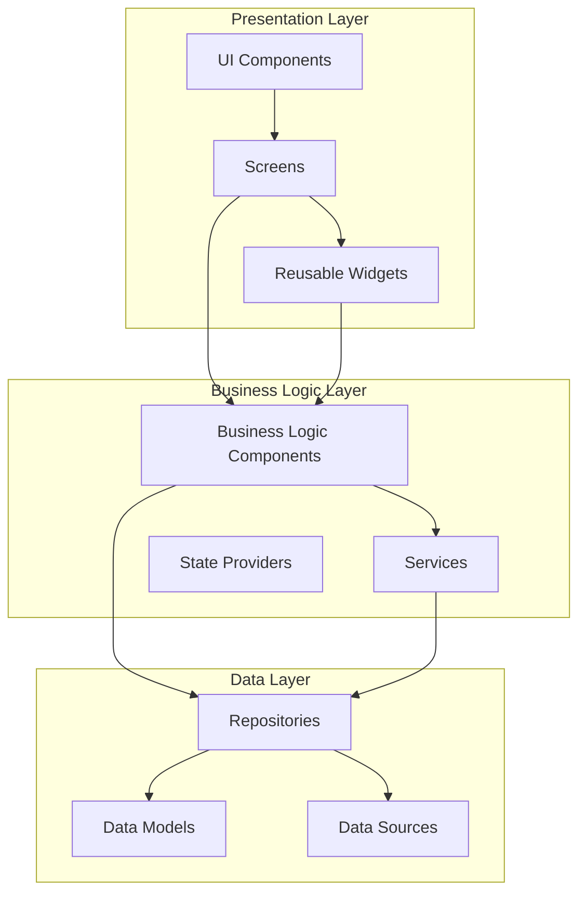
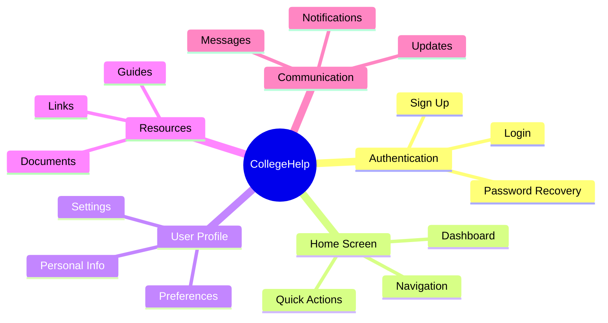
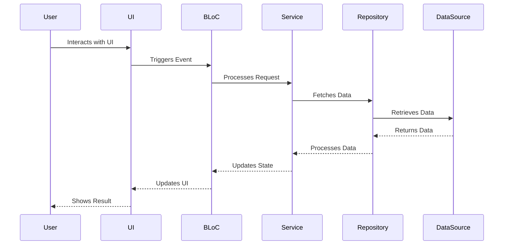
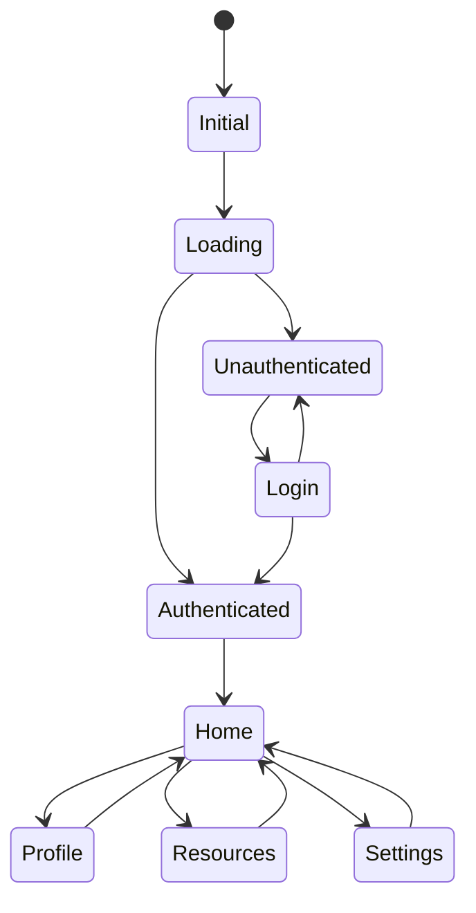
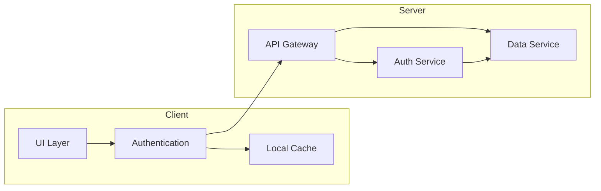

# CollegeHelp Architecture Overview

## System Architecture

The CollegeHelp application is built using Flutter, following a clean architecture pattern with clear separation of concerns. The application is structured into several key layers that work together to provide a seamless user experience.

## Component Relationships

### 1. Presentation Layer
- **Screens**: Main UI containers that represent different pages/views
- **Widgets**: Reusable UI components used across screens
- **Navigation**: Handles routing between different screens

### 2. Business Logic Layer
- **Services**: Handle business logic and data processing
- **State Management**: Manages application state using providers
- **BLoC**: Business Logic Components for handling complex state management

### 3. Data Layer
- **Models**: Data structures representing business entities
- **Repositories**: Abstract data access layer
- **Data Sources**: Concrete implementations for data storage/retrieval

## Key Features and Components

## Data Flow

## State Management

## Security Architecture

## Performance Considerations

1. **Caching Strategy**
   - Local storage for offline access
   - Memory cache for frequently accessed data
   - Image caching for media content

2. **Lazy Loading**
   - Screen components loaded on demand
   - Resource-heavy features loaded dynamically
   - Pagination for large data sets

3. **Optimization Techniques**
   - Widget rebuilding optimization
   - Memory management
   - Network request batching

## Future Considerations

1. **Scalability**
   - Microservices architecture potential
   - Horizontal scaling capabilities
   - Load balancing strategies

2. **Integration Points**
   - External API integrations
   - Third-party service connections
   - Cross-platform compatibility

3. **Maintenance**
   - Code organization
   - Testing strategies
   - Documentation requirements 