# Component-Level Architecture Documentation

## 1. Authentication System

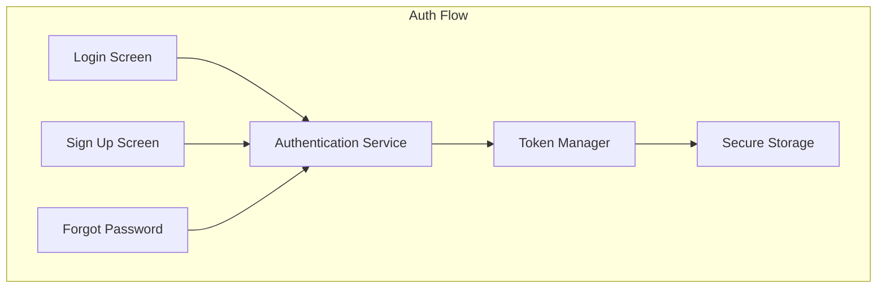

### Components:
- **Login Screen**: Handles user authentication
- **Sign Up Screen**: New user registration
- **Forgot Password**: Password recovery flow
- **Authentication Service**: Manages auth state and API calls
- **Token Manager**: Handles JWT tokens and refresh logic
- **Secure Storage**: Encrypted storage for sensitive data

## 2. Home Screen Architecture

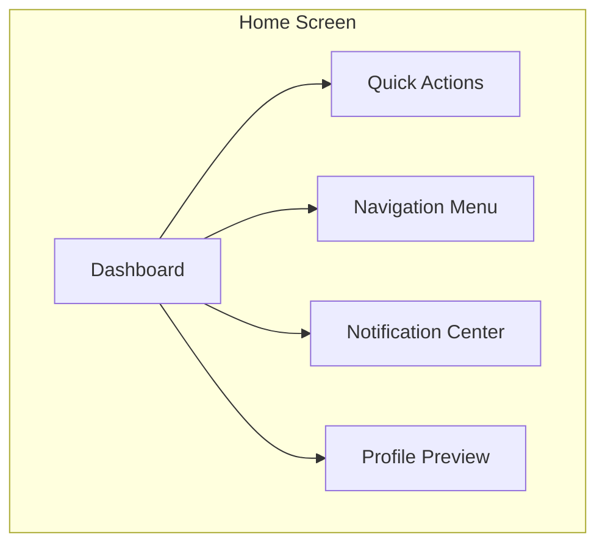

### Components:
- **Dashboard**: Main content area with user-specific information
- **Quick Actions**: Frequently used features
- **Navigation Menu**: App-wide navigation
- **Notification Center**: Real-time updates
- **Profile Preview**: User information summary

## 3. Data Management

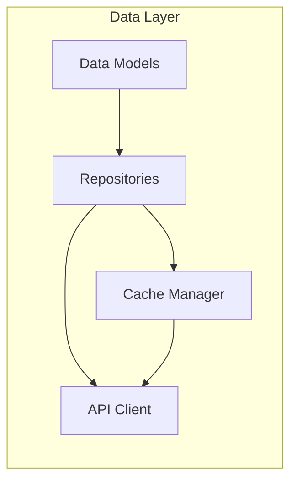

### Components:
- **Data Models**: Business logic entities
- **Repositories**: Data access abstraction
- **Cache Manager**: Local data storage
- **API Client**: Network communication

## 4. State Management

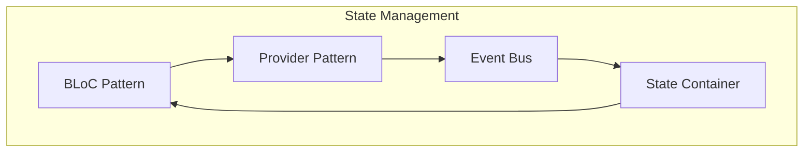

### Components:
- **BLoC Pattern**: Business logic and state management
- **Provider Pattern**: Dependency injection
- **Event Bus**: Inter-component communication
- **State Container**: Centralized state storage

## 5. Navigation System

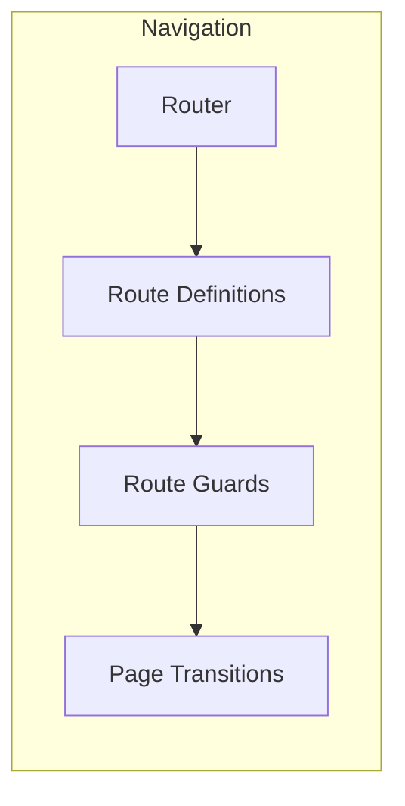

### Components:
- **Router**: Navigation controller
- **Route Definitions**: Screen mappings
- **Route Guards**: Navigation protection
- **Page Transitions**: Screen animations

## 6. UI Component Library

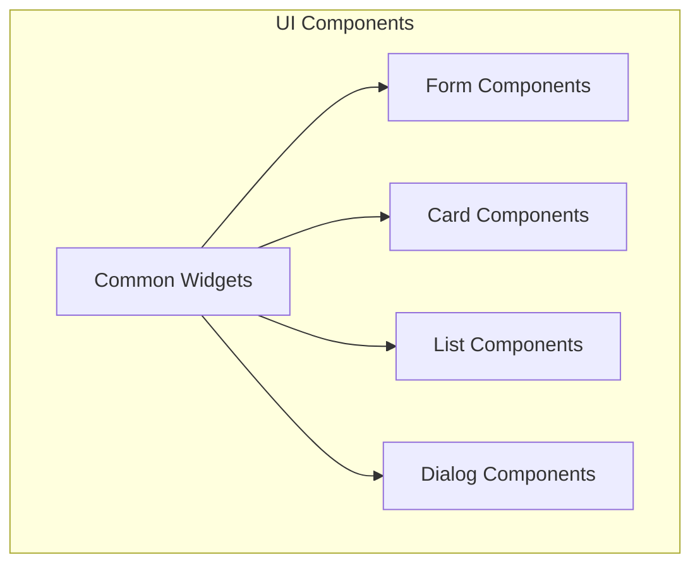

### Components:
- **Common Widgets**: Base UI elements
- **Form Components**: Input and validation
- **Card Components**: Content containers
- **List Components**: Data display
- **Dialog Components**: Modal interfaces

## 7. Network Layer

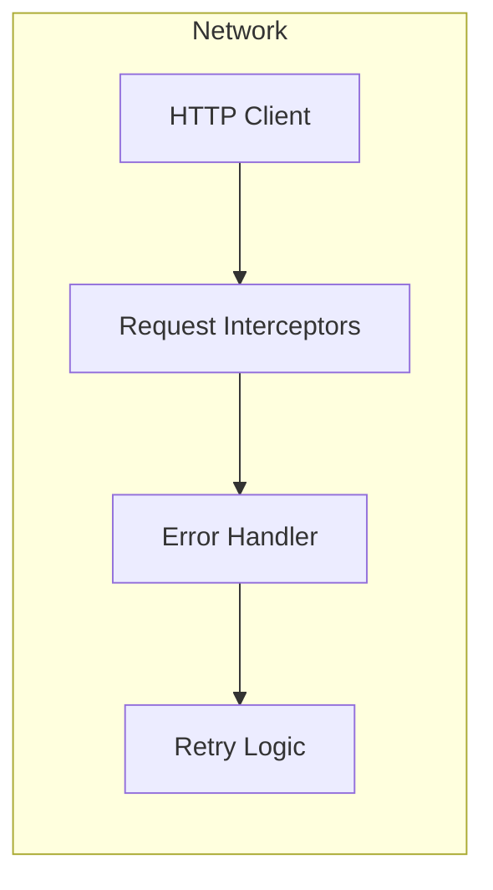

### Components:
- **HTTP Client**: Network requests
- **Request Interceptors**: Request/response modification
- **Error Handler**: Error management
- **Retry Logic**: Request retry mechanism

## 8. Local Storage

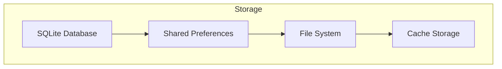

### Components:
- **SQLite Database**: Structured data storage
- **Shared Preferences**: Key-value storage
- **File System**: File operations
- **Cache Storage**: Temporary data

## 9. Testing Architecture

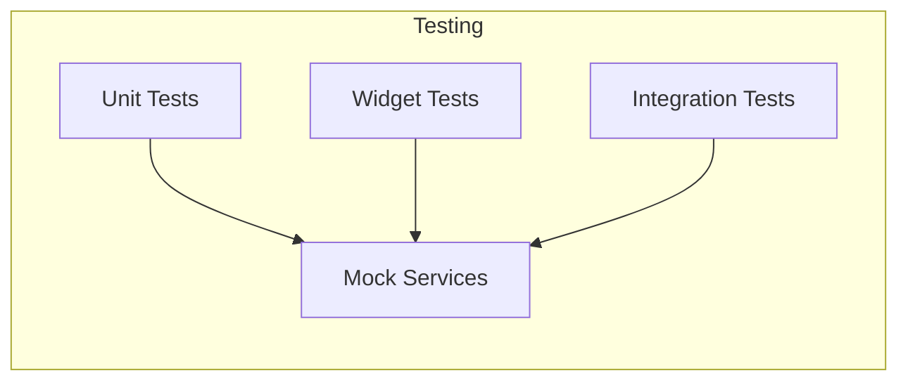

### Components:
- **Unit Tests**: Business logic testing
- **Widget Tests**: UI component testing
- **Integration Tests**: End-to-end testing
- **Mock Services**: Test data providers

## 10. Error Handling

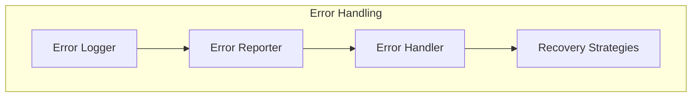

### Components:
- **Error Logger**: Error tracking
- **Error Reporter**: Error reporting
- **Error Handler**: Error management
- **Recovery Strategies**: Error recovery

## Component Interactions

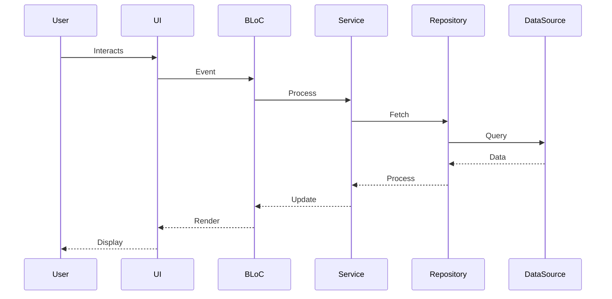

## Component Dependencies

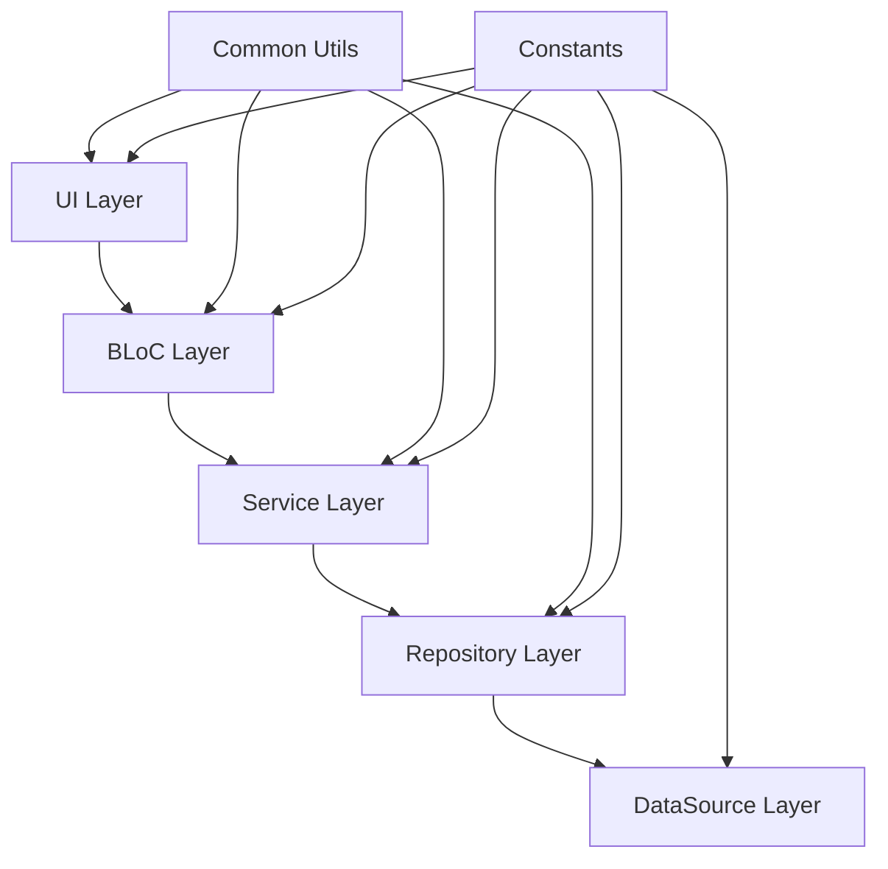