# Technical Implementation Details

## 1. Technology Stack

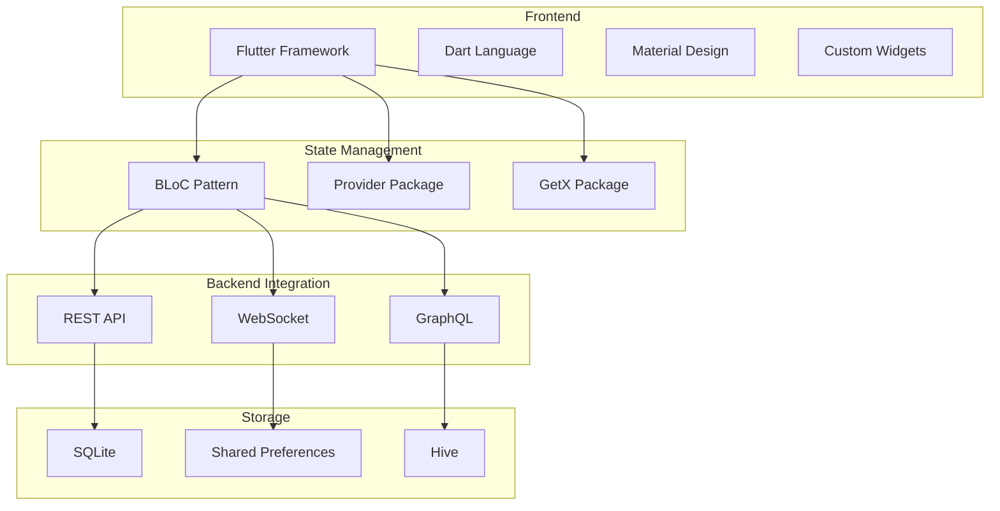

## 2. Code Organization

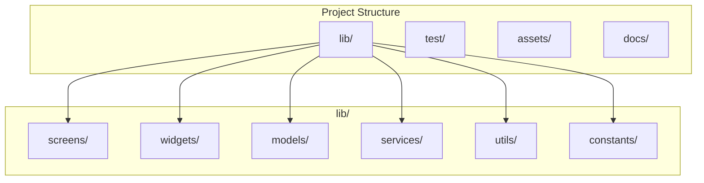

## 3. State Management Implementation

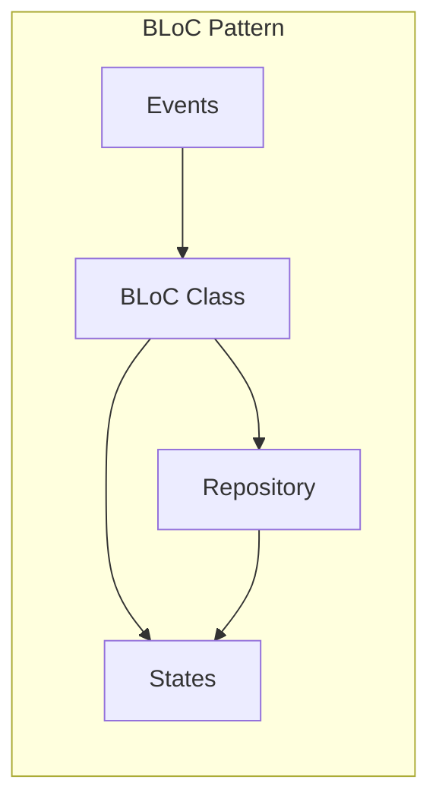

### Implementation Details:
- **Events**: Input events that trigger state changes
- **States**: Immutable state objects
- **BLoC**: Business logic processing
- **Repository**: Data access layer

## 4. Data Flow Architecture

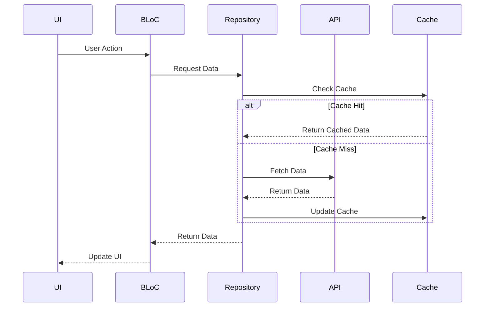

## 5. Network Layer Implementation

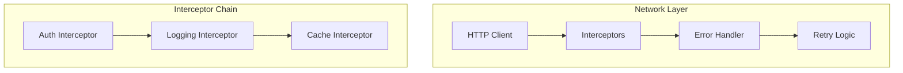

### Implementation Details:
- **HTTP Client**: Dio package implementation
- **Interceptors**: Request/response modification
- **Error Handler**: Custom error handling
- **Retry Logic**: Exponential backoff

## 6. Local Storage Implementation

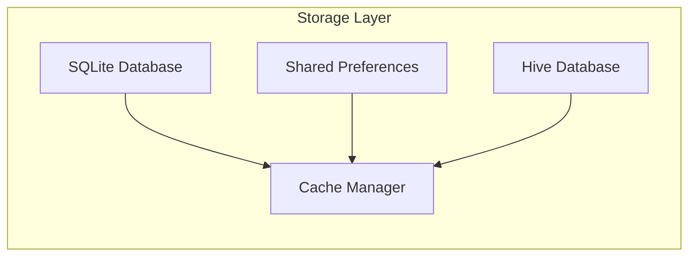

### Implementation Details:
- **SQLite**: Complex data storage
- **Shared Preferences**: Simple key-value storage
- **Hive**: Fast NoSQL storage
- **Cache Manager**: Unified cache interface

## 7. UI Component Architecture

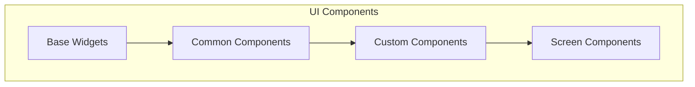

### Implementation Details:
- **Base Widgets**: Core Flutter widgets
- **Common Components**: Reusable UI elements
- **Custom Components**: Application-specific widgets
- **Screen Components**: Full page layouts

## 8. Testing Strategy

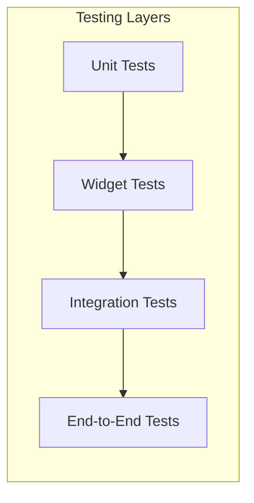

### Implementation Details:
- **Unit Tests**: Business logic testing
- **Widget Tests**: UI component testing
- **Integration Tests**: Feature testing
- **E2E Tests**: Full flow testing

## 9. Performance Optimization

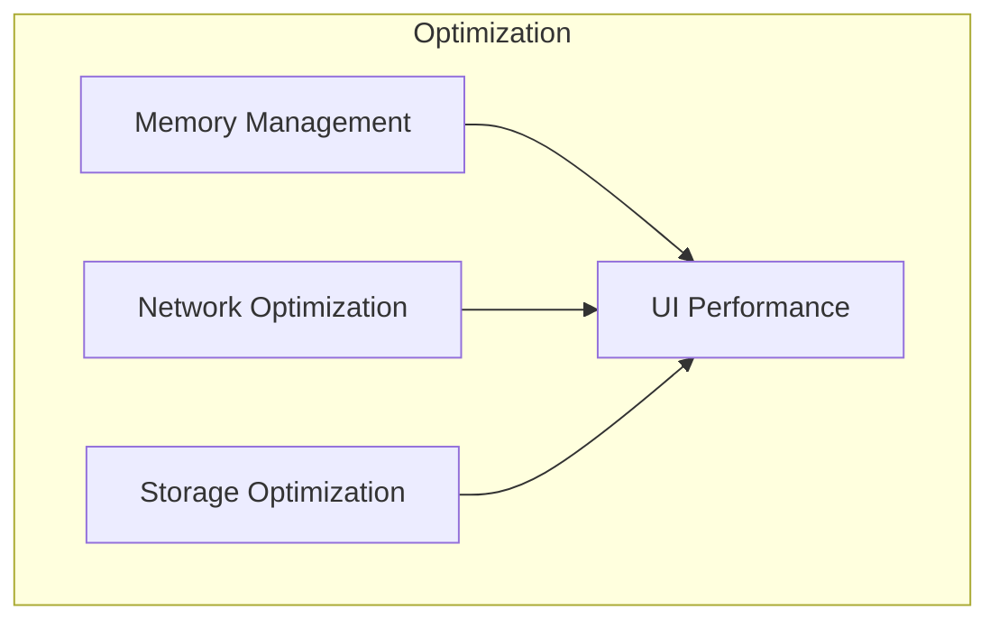

### Implementation Details:
- **Memory Management**: Resource cleanup
- **Network Optimization**: Request batching
- **UI Performance**: Widget optimization
- **Storage Optimization**: Cache management

## 10. Security Implementation

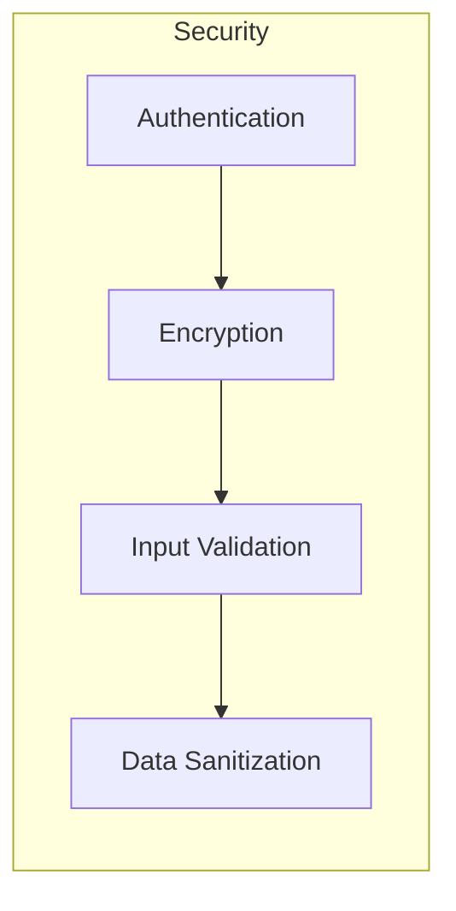

### Implementation Details:
- **Authentication**: JWT token management
- **Encryption**: Data encryption
- **Input Validation**: Form validation
- **Data Sanitization**: XSS prevention

## 11. Error Handling Strategy

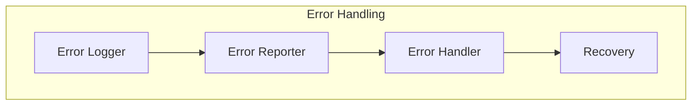

### Implementation Details:
- **Error Logger**: Custom logging
- **Error Reporter**: Error tracking
- **Error Handler**: Error management
- **Recovery**: Error recovery strategies

## 12. Build and Deployment

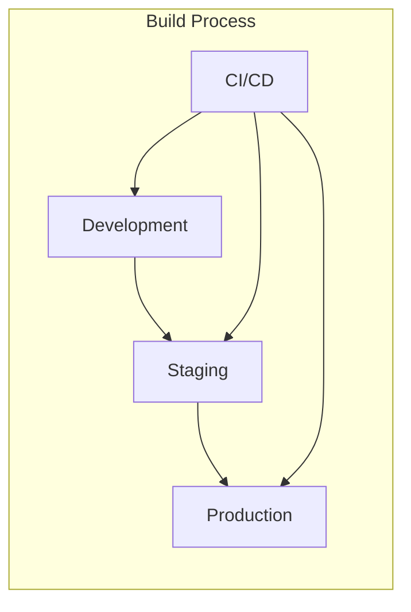

### Implementation Details:
- **Development**: Local development
- **Staging**: Testing environment
- **Production**: Live environment
- **CI/CD**: Automated deployment 