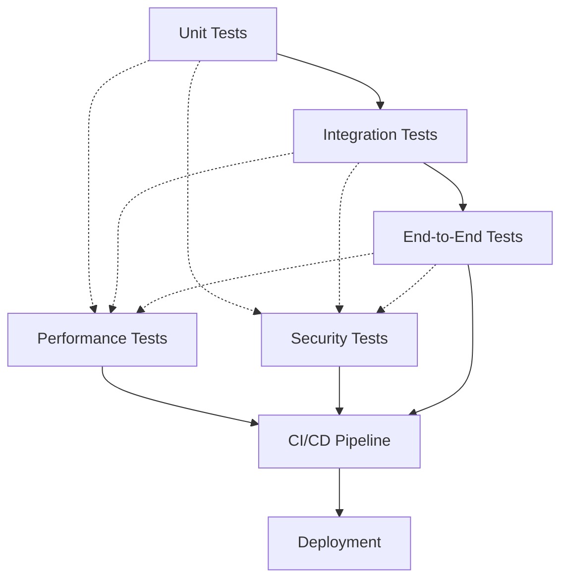

# CollegeHelp Testing Strategy

## Overview

This document outlines the comprehensive testing strategy for the CollegeHelp platform, a mobile application designed to provide New College students at the University of Toronto with easy access to college services, information, and resources. As a system designed to serve thousands of students, ensuring high reliability, security, and performance is critical. Our test approach follows a multi-layered strategy to validate all aspects of the application.

## Test Pyramid Approach

We follow the test pyramid concept to balance thoroughness with efficiency:

## Key Testing Priorities

1. **User Data Protection** - All authentication and student information components undergo rigorous security testing
2. **System Stability** - Performance testing ensures the platform remains responsive under peak load conditions
3. **Feature Correctness** - Comprehensive testing of college service information (dining, residence, events, registrar)
4. **Accessibility** - Testing ensures the platform is usable by all students regardless of disabilities
5. **Cross-platform Compatibility** - Testing across devices and browsers ensures consistent user experience

## Test Environment Requirements

| Environment | Purpose | Configuration |
|-------------|---------|---------------|
| Development | Unit and integration tests | Local developer machines with test databases |
| Staging | Integration, E2E, performance tests | Production-like environment with test data |
| Production | Smoke tests, monitoring | Live environment with real data |

## Test Automation Approach

- **CI/CD Integration**: All tests are integrated into the CI/CD pipeline
- **Automated Regression**: Automatic execution after each code change
- **Manual Exploratory**: Supplement automated tests with targeted exploratory testing
- **Continuous Monitoring**: Real-time performance and error tracking in production

## Test Coverage Goals

| Component | Coverage Target | Priority |
|-----------|----------------|----------|
| Authentication | 95% | Critical |
| Home Dashboard | 90% | High |
| Dining Information | 90% | High |
| Residence Information | 90% | High |
| Events Calendar | 85% | Medium |
| Registrar Services | 90% | High |
| User Interface | 80% | Medium |
| Notifications | 85% | Medium |

This strategy is designed to evolve as the application grows. See individual test documentation files for specific implementation details. 