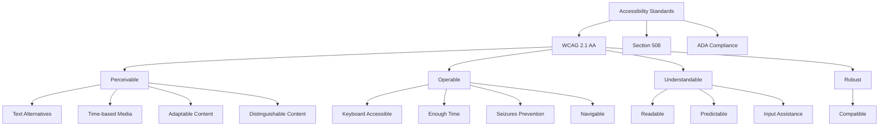
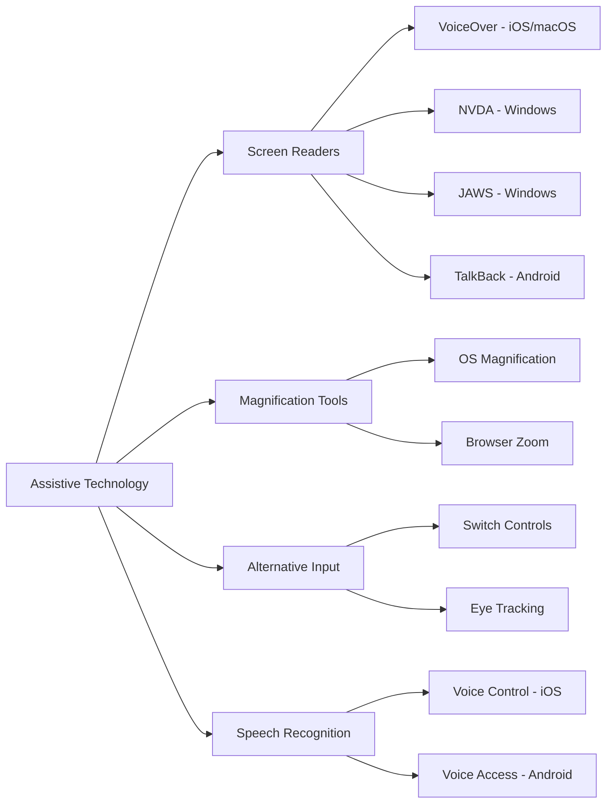
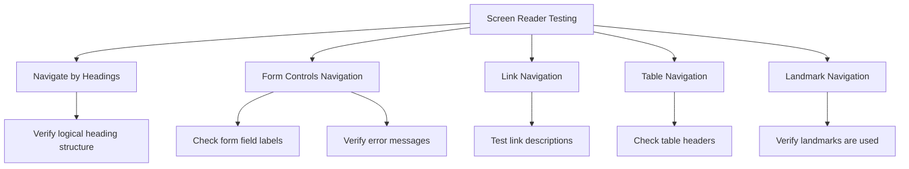
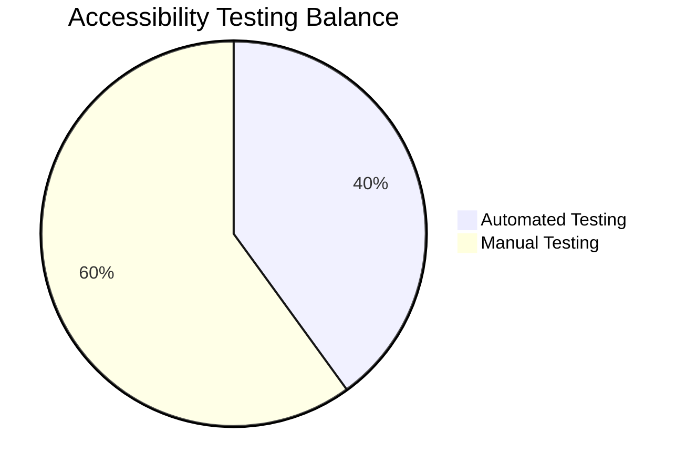
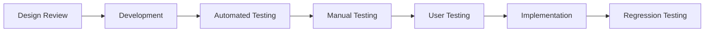

# Accessibility Testing Strategy

## Overview

Accessibility testing ensures that the CollegeHelp platform is usable by all students, including those with disabilities. For an educational platform, accessibility is not only a legal requirement but also a crucial aspect of providing equal educational opportunities to all users. This document outlines our comprehensive approach to accessibility testing.

## Accessibility Standards

The CollegeHelp platform adheres to the following accessibility standards:



## Key Accessibility Testing Areas

### Visual Accessibility

| Testing Area | Testing Method | Priority |
|--------------|----------------|----------|
| Color Contrast | Automated contrast checking, manual verification | High |
| Text Resizing | UI testing with different font sizes | High |
| Screen Reader Compatibility | Testing with VoiceOver, NVDA, JAWS | Critical |
| Alternative Text | Verify all images have meaningful alt text | Critical |

### Motor/Mobility Accessibility

| Testing Area | Testing Method | Priority |
|--------------|----------------|----------|
| Keyboard Navigation | Verify all functionality is accessible via keyboard | Critical |
| Touch Target Size | Verify buttons and interactive elements are large enough | High |
| Input Methods | Test with various input devices (switches, voice commands) | Medium |
| Gesture Alternatives | Ensure gesture-based interactions have alternatives | Medium |

### Cognitive Accessibility

| Testing Area | Testing Method | Priority |
|--------------|----------------|----------|
| Simple Language | Review content for readability | Medium |
| Consistent Navigation | Verify consistent UI patterns | High |
| Error Identification | Test error messages for clarity | High |
| Time Limitations | Test timeout extensions and warnings | Medium |

## Assistive Technology Compatibility



## Accessibility Testing Tools

1. **Automated Testing Tools**
   - **Axe** - For automated WCAG testing
   - **Lighthouse** - For accessibility audits
   - **WAVE** - For visual accessibility evaluations
   - **Deque aXe** - For accessibility testing in development

2. **Manual Testing Tools**
   - **Screen Readers** - VoiceOver, NVDA, JAWS, TalkBack
   - **Keyboard Testing** - Tab order, focus indicators
   - **Color Contrast Analyzers** - Color Oracle, Contrast Checker

## Test Implementation Example

```dart
// Example of automated accessibility testing using Flutter Accessibility Test
testWidgets('Login screen meets accessibility guidelines', (WidgetTester tester) async {
  // Build the login widget
  await tester.pumpWidget(MaterialApp(
    home: LoginScreen(),
  ));

  // Wait for the widget to fully render
  await tester.pumpAndSettle();

  // Get the semantic tree
  final SemanticsHandle handle = tester.ensureSemantics();
  
  // Check that all images have labels
  final Finder images = find.byType(Image);
  for (final Element element in images.evaluate()) {
    final Widget widget = element.widget;
    expect(
      widget is Image && (widget.semanticLabel != null || widget.excludeFromSemantics),
      isTrue,
      reason: 'All images should have semantic labels or be excluded from semantics',
    );
  }
  
  // Check that all interactive elements are labeled
  final Finder buttons = find.byType(ElevatedButton);
  for (final Element element in buttons.evaluate()) {
    final Widget widget = element.widget;
    final Semantics semantics = tester.widget(find.ancestor(
      of: find.byWidget(widget),
      matching: find.byType(Semantics),
    ).first);
    
    expect(
      semantics.label != null || semantics.excludeSemantics,
      isTrue,
      reason: 'All buttons should have semantic labels',
    );
  }
  
  // Check for sufficient contrast (would require a more complex implementation)
  
  // Release the semantics handle
  handle.dispose();
});
```

## Screen Reader Testing Checklist

### Key Navigation Elements

| Element | Expected Behavior | Testing Method |
|---------|-------------------|----------------|
| Navigation Menu | Announced with role and state | Test with VoiceOver, NVDA |
| Form Fields | Labels announced, errors identified | Input and validation testing |
| Modal Dialogs | Focus trapped, dismissal controls | Open/close dialog testing |
| Custom Components | Proper role and state announcements | Component interaction testing |

### Common Screen Reader Commands to Test



## Mobile Accessibility Testing

For the Flutter mobile application:

1. **Platform-Specific Testing**
   - **iOS**: Test with VoiceOver and Dynamic Type
   - **Android**: Test with TalkBack and font scaling

2. **Touch Target Size**
   - Verify all interactive elements are at least 44×44 points (iOS) or 48×48 dp (Android)

3. **Gestures**
   - Ensure all gesture-based interactions have accessible alternatives

## Automated vs. Manual Testing



While automated tools catch many issues, manual testing is essential for:
1. Screen reader compatibility
2. Keyboard navigation testing
3. Cognitive accessibility evaluation
4. Real-world usability with assistive technology

## Testing with Real Users

When possible, include testing with actual users who rely on assistive technology:

1. **Recruitment**: Partner with disability organizations
2. **Test Scenarios**: Create realistic educational tasks
3. **Feedback Collection**: Structured interviews and observations
4. **Implementation**: Prioritize improvements based on user feedback

## Accessibility Testing in Development Workflow



## Best Practices

1. **Early Integration**: Include accessibility from the design phase
2. **Developer Training**: Ensure developers understand accessibility requirements
3. **Regular Audits**: Schedule periodic accessibility reviews
4. **Documentation**: Document accessibility features for users
5. **Prioritization**: Focus on critical user flows first

## Common Accessibility Issues and Solutions

| Issue | Detection Method | Solution |
|-------|------------------|----------|
| Low Color Contrast | Contrast analyzers | Adjust color palette to meet WCAG AA (4.5:1) |
| Missing Alt Text | Automated scanners | Add descriptive alternative text |
| Keyboard Traps | Manual testing | Ensure focus can move in and out of all components |
| Timing Issues | User testing | Add options to extend timeouts |
| Complex Navigation | Screen reader testing | Simplify page structure, add skip links |

## Continuous Improvement

- Regular accessibility audits of existing features
- Inclusion of accessibility testing in all new feature development
- Tracking of accessibility issues in the bug tracking system
- Regular developer training on accessibility best practices 