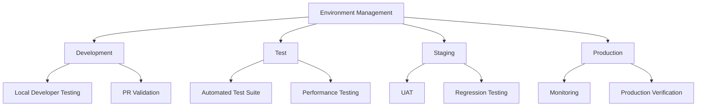
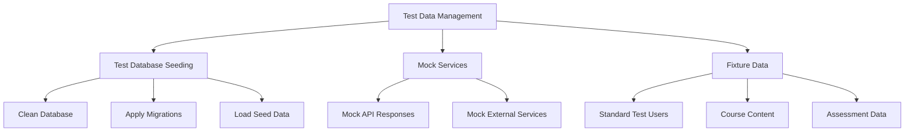
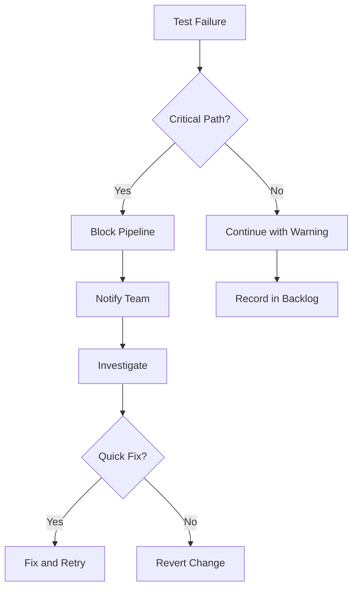

# CI/CD Integration for Testing

## Overview

This document outlines how testing is integrated into the Continuous Integration/Continuous Deployment (CI/CD) pipeline for the CollegeHelp platform. Automating test execution within the CI/CD pipeline ensures consistent quality checks, early detection of issues, and enables faster, more reliable releases.

## CI/CD Pipeline Architecture

```mermaid
graph LR
    A[Code Commit] --> B[Static Analysis]
    B --> C[Build]
    C --> D[Unit Tests]
    D --> E[Integration Tests]
    E --> F[Deploy to Test]
    F --> G[E2E Tests]
    G --> H[Performance Tests]
    H --> I[Security Scans]
    I --> J[Deploy to Staging]
    J --> K[Smoke Tests]
    K --> L[Manual Verification]
    L --> M[Deploy to Production]
    M --> N[Production Monitoring]
```



## Test Execution Stages

### Early Pipeline Stages

| Stage | Tests Executed | Failure Criteria | Response Time |
|-------|----------------|------------------|---------------|
| Static Analysis | Code quality, linting, static security analysis | Any critical issues | < 5 minutes |
| Unit Tests | All unit tests | Any test failure | < 10 minutes |
| Integration Tests | Core integration tests | Any critical test failure | < 20 minutes |

### Mid Pipeline Stages

| Stage | Tests Executed | Failure Criteria | Response Time |
|-------|----------------|------------------|---------------|
| E2E Tests | Core user journeys | Any critical flow failure | < 30 minutes |
| Performance Tests | Load tests on key API endpoints | Exceeding performance thresholds | < 45 minutes |
| Security Scans | OWASP checks, dependency scanning | Any high/critical vulnerabilities | < 30 minutes |

### Late Pipeline Stages

| Stage | Tests Executed | Failure Criteria | Response Time |
|-------|----------------|------------------|---------------|
| Smoke Tests | Core functionality in staging | Any test failure | < 15 minutes |
| Accessibility Checks | Automated accessibility tests | Failing WCAG A requirements | < 15 minutes |
| Manual Verification | Exploratory testing | Team decision | Variable |

## CI/CD Tools and Configuration

We use the following tools within our CI/CD pipeline:

1. **GitHub Actions** - CI/CD pipeline orchestration
2. **Flutter Test** - Unit and widget testing
3. **integration_test** - Flutter integration testing
4. **SonarQube** - Code quality and static analysis
5. **JMeter/Locust** - Performance testing
6. **OWASP ZAP** - Security scanning
7. **Lighthouse** - Accessibility and performance checks

## Example CI/CD Configuration

```yaml
# GitHub Actions workflow example for CollegeHelp
name: CollegeHelp CI/CD Pipeline

on:
  push:
    branches: [ main, develop ]
  pull_request:
    branches: [ main, develop ]

jobs:
  analyze:
    runs-on: ubuntu-latest
    steps:
      - uses: actions/checkout@v3
      - uses: subosito/flutter-action@v2
      - name: Install dependencies
        run: flutter pub get
      - name: Analyze code
        run: flutter analyze
      - name: Check formatting
        run: flutter format --set-exit-if-changed .

  unit_tests:
    needs: analyze
    runs-on: ubuntu-latest
    steps:
      - uses: actions/checkout@v3
      - uses: subosito/flutter-action@v2
      - name: Install dependencies
        run: flutter pub get
      - name: Run unit tests
        run: flutter test --coverage
      - name: Upload coverage
        uses: codecov/codecov-action@v3

  integration_tests:
    needs: unit_tests
    runs-on: macos-latest
    steps:
      - uses: actions/checkout@v3
      - uses: subosito/flutter-action@v2
      - name: Install dependencies
        run: flutter pub get
      - name: Build iOS
        run: flutter build ios --release --no-codesign
      - name: Run integration tests
        run: flutter test integration_test/app_test.dart

  deploy_test:
    needs: integration_tests
    if: github.ref == 'refs/heads/develop'
    runs-on: ubuntu-latest
    steps:
      - uses: actions/checkout@v3
      - name: Deploy to test environment
        run: ./scripts/deploy_to_test.sh
      
  e2e_tests:
    needs: deploy_test
    if: github.ref == 'refs/heads/develop'
    runs-on: ubuntu-latest
    steps:
      - uses: actions/checkout@v3
      - name: Run E2E tests
        run: ./scripts/run_e2e_tests.sh
        
  security_scan:
    needs: deploy_test
    if: github.ref == 'refs/heads/develop'
    runs-on: ubuntu-latest
    steps:
      - uses: actions/checkout@v3
      - name: ZAP Scan
        uses: zaproxy/action-full-scan@v0.7.0
        with:
          target: 'https://test-env.collegehelp.edu'
          
  deploy_staging:
    needs: [e2e_tests, security_scan]
    if: github.ref == 'refs/heads/develop'
    runs-on: ubuntu-latest
    steps:
      - uses: actions/checkout@v3
      - name: Deploy to staging
        run: ./scripts/deploy_to_staging.sh
        
  smoke_tests:
    needs: deploy_staging
    if: github.ref == 'refs/heads/develop'
    runs-on: ubuntu-latest
    steps:
      - uses: actions/checkout@v3
      - name: Run smoke tests
        run: ./scripts/run_smoke_tests.sh
        
  deploy_production:
    needs: smoke_tests
    if: github.ref == 'refs/heads/main'
    runs-on: ubuntu-latest
    environment: production
    steps:
      - uses: actions/checkout@v3
      - name: Deploy to production
        run: ./scripts/deploy_to_production.sh
```

## Test Environment Management



## Testing Artifacts and Reporting

### Generated Testing Artifacts

| Artifact | Purpose | Storage Location | Retention Period |
|----------|---------|------------------|------------------|
| Test Reports | Document test results | S3/GCS bucket | 90 days |
| Code Coverage | Track test coverage | Codecov | Unlimited |
| Performance Reports | Track performance metrics | Grafana/CloudWatch | 1 year |
| Security Scan Reports | Document vulnerabilities | Security Dashboard | 1 year |
| Screenshots/Videos | Visual record of UI tests | S3/GCS bucket | 30 days |

### Automated Reporting

The CI/CD pipeline automatically:

1. **Publishes Test Results** - To a central dashboard
2. **Sends Notifications** - For test failures via Slack/Teams
3. **Updates Tickets** - Links test results to Jira tickets
4. **Generates Trends** - To track quality metrics over time

## Test Data Management in CI/CD



## Parallel Test Execution

To optimize pipeline speed, tests are executed in parallel:

1. **Unit Tests** - Sharded by test groups
2. **Integration Tests** - Sharded by modules
3. **E2E Tests** - Sharded by user journeys
4. **Device Testing** - Parallel execution on device matrix

## Pipeline Optimization Strategies

| Strategy | Implementation | Performance Impact |
|----------|----------------|-------------------|
| Test Selection | Only run tests affected by changes | 50-80% reduction in test time |
| Caching | Cache build artifacts and dependencies | 30-50% faster builds |
| Parallelization | Run tests in parallel | 70-90% faster test execution |
| Early Termination | Fail fast for critical issues | Variable improvement |
| Test Prioritization | Run critical tests first | Faster feedback for critical paths |

## Pipeline Monitoring and Metrics

We track the following metrics for our CI/CD pipeline:

1. **Pipeline Duration** - Total time from commit to production
2. **Stage Duration** - Time for each pipeline stage
3. **Test Pass Rate** - Percentage of passing tests
4. **Flaky Test Rate** - Tests with inconsistent results
5. **Coverage Trends** - Changes in test coverage over time

## Handling Test Failures



## Release Criteria

For a release to proceed to production, it must meet these testing criteria:

1. **All Critical Tests Pass**: 100% pass rate for critical tests
2. **Minimum Coverage**: Maintain >80% code coverage
3. **Performance Thresholds**: API response times <200ms
4. **No Critical Security Issues**: Zero high/critical security vulnerabilities
5. **Accessibility Compliance**: Meet WCAG 2.1 AA requirements

## Best Practices

1. **Shift Left**: Move testing earlier in the pipeline
2. **Fail Fast**: Prioritize quick tests that catch common issues
3. **Consistency**: Use the same testing approach in all environments
4. **Automation**: Minimize manual intervention in the pipeline
5. **Visibility**: Make test results easily accessible to the team

## Continuous Improvement

Our CI/CD testing process is continuously improved through:

1. **Pipeline Analytics**: Regular review of pipeline metrics
2. **Test Optimization**: Refactoring slow or flaky tests
3. **Coverage Expansion**: Continually increasing test coverage
4. **Tool Evaluation**: Regular assessment of testing tools
5. **Feedback Loop**: Developer input on pipeline effectiveness 