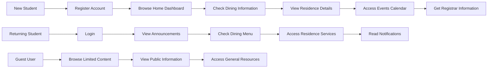
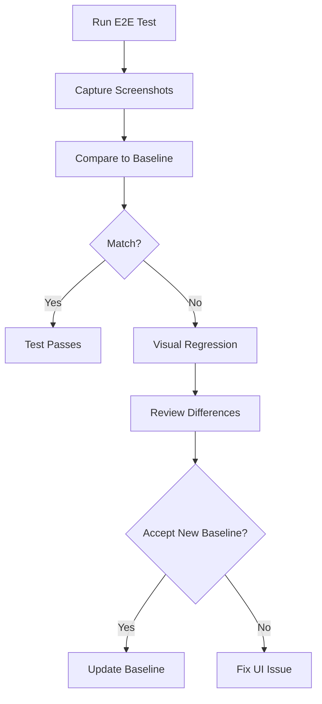

# End-to-End Testing Strategy

## Overview

End-to-End (E2E) tests validate complete user journeys through the CollegeHelp platform, ensuring that all components work together seamlessly from a user perspective. These tests simulate real student behavior as they navigate through various college services and information resources offered by the New College app.

## Key User Journeys



## Critical User Flows to Test

### Student User Journey

| User Flow | Description | Priority |
|-----------|-------------|----------|
| Complete Registration | From account creation to profile completion | Critical |
| Information Discovery | Finding and navigating to college information resources | Critical |
| Notification Interaction | Receiving and viewing important college announcements | High |
| Profile Management | Updating profile information and settings | Medium |

### Guest User Journey

| User Flow | Description | Priority |
|-----------|-------------|----------|
| Public Information Access | Accessing non-authenticated information | High |
| Limited Feature Navigation | Verifying appropriate restrictions | Critical |
| Registration Conversion | Flow from guest browsing to account creation | Medium |

### Administrative Journey

| User Flow | Description | Priority |
|-----------|-------------|----------|
| Announcement Creation | Creating and publishing college announcements | High |
| Content Management | Updating dining, residence, and event information | High |
| User Management | Managing student accounts if applicable | Medium |

## E2E Testing Tools

For the CollegeHelp platform, we use:

1. **Flutter Integration Tests** - For cross-platform mobile testing
2. **Playwright** - For web application testing if applicable
3. **Appium** - For supplemental mobile testing
4. **TestRail** - For test case management and execution tracking

## Test Implementation Example

```dart
// Using Flutter Integration Test Framework
void main() {
  IntegrationTestWidgetsFlutterBinding.ensureInitialized();

  group('Student Registration and Information Access', () {
    testWidgets('New student can register and access college information', (WidgetTester tester) async {
      // Launch app
      app.main();
      await tester.pumpAndSettle();
      
      // Navigate to registration
      await tester.tap(find.byKey(Key('signUpButton')));
      await tester.pumpAndSettle();
      
      // Fill registration form
      await tester.enterText(find.byKey(Key('nameField')), 'Test Student');
      await tester.enterText(find.byKey(Key('emailField')), 'teststudent@mail.utoronto.ca');
      await tester.enterText(find.byKey(Key('passwordField')), 'securePassword123');
      await tester.enterText(find.byKey(Key('confirmPasswordField')), 'securePassword123');
      await tester.tap(find.byKey(Key('createAccountButton')));
      await tester.pumpAndSettle();
      
      // Verify dashboard is shown
      expect(find.text('Welcome to New College'), findsOneWidget);
      
      // Navigate to dining tab
      await tester.tap(find.byIcon(Icons.restaurant));
      await tester.pumpAndSettle();
      
      // Verify dining information
      expect(find.text('Dining Hall Hours'), findsOneWidget);
      
      // Navigate to residence tab
      await tester.tap(find.byIcon(Icons.apartment));
      await tester.pumpAndSettle();
      
      // Verify residence information
      expect(find.text('Residence Information'), findsOneWidget);
      
      // Check events calendar
      await tester.tap(find.byIcon(Icons.event));
      await tester.pumpAndSettle();
      
      // Verify events are displayed
      expect(find.text('Upcoming Events'), findsOneWidget);
      
      // Access registrar information
      await tester.tap(find.byIcon(Icons.school));
      await tester.pumpAndSettle();
      
      // Verify registrar information
      expect(find.text('Registrar\'s Office'), findsOneWidget);
    });
  });
}
```

## Cross-Platform E2E Testing

The CollegeHelp platform must be tested across multiple devices and platforms:

| Platform | Devices to Test | Key Considerations |
|----------|----------------|-------------------|
| iOS | iPhone (latest), iPhone (older), iPad | Screen sizes, iOS versions |
| Android | Flagship device, Budget device, Tablet | Fragmentation, performance on lower-end devices |
| Web | Chrome, Firefox, Safari, Edge | Responsive design, browser compatibility if web version exists |

## Visual Validation

E2E tests include visual validation to ensure consistent UI across platforms:



## Accessibility Testing in E2E

All E2E tests include accessibility validation:

1. **Screen Reader Compatibility** - Test navigation with VoiceOver/TalkBack
2. **Keyboard Navigation** - Ensure all functionality is accessible via keyboard when applicable
3. **Color Contrast** - Validate contrast ratios for text elements
4. **Text Scaling** - Test with enlarged text settings

## Network Condition Testing

E2E tests are run under various network conditions:

| Network Condition | Simulation Method | Expected Outcome |
|-------------------|-------------------|-----------------|
| Ideal Connection | Full speed | Smooth operation |
| Slow Connection | Throttled bandwidth | Graceful loading with indicators |
| Intermittent Connection | Random packet loss | Error handling and retry mechanisms |
| Offline | No connection | Offline mode functionality if applicable |

## Best Practices

1. **Test Real User Scenarios** - Focus on common student user journeys
2. **Stable Test Environment** - Use consistent test data and environment configuration
3. **Maintainable Tests** - Use page objects and reusable components
4. **Parallel Execution** - Run tests in parallel to reduce execution time
5. **Video Recording** - Capture test execution for debugging failures

## Common Pitfalls and Solutions

| Pitfall | Solution |
|---------|----------|
| Flaky Tests | Implement retry mechanisms, improve waiting strategies |
| Slow Tests | Run tests in parallel, optimize setup/teardown |
| Fragile Selectors | Use stable test IDs instead of text or CSS selectors |
| Data Dependencies | Reset data between tests, use isolated test data |

## Continuous Improvement

- Regularly review and update E2E test scenarios based on student feedback
- Monitor test execution metrics to identify slow or flaky tests
- Prioritize automated E2E tests for critical student journeys 