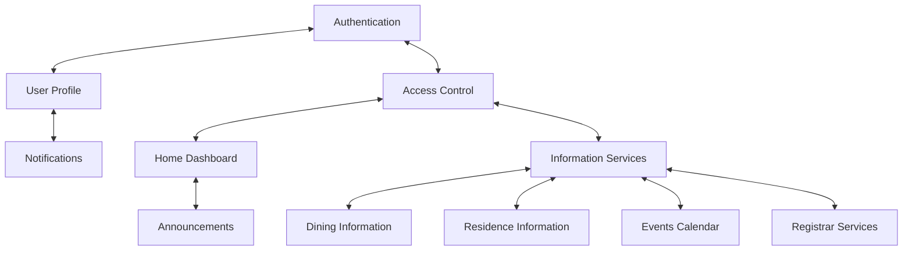
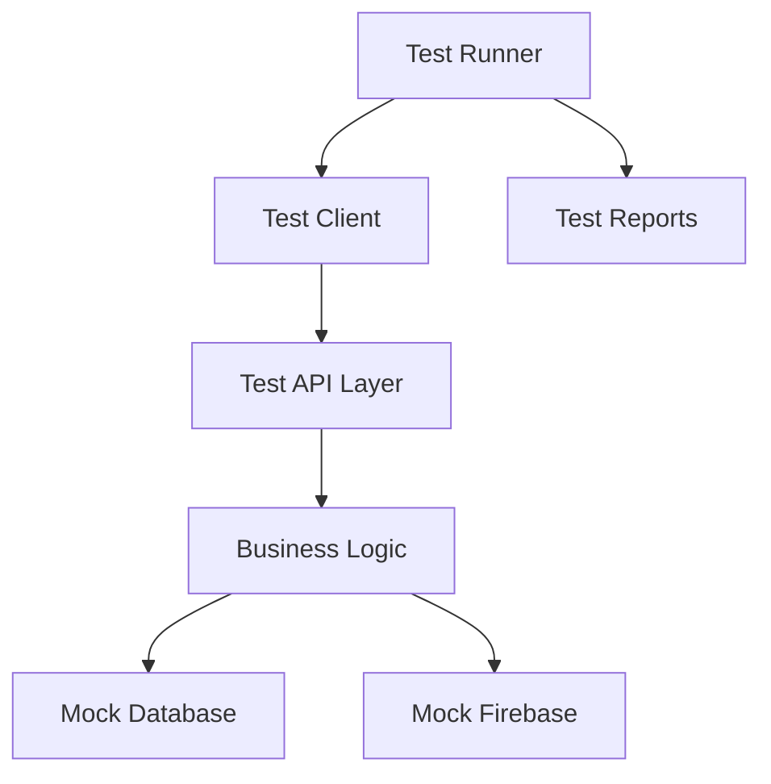
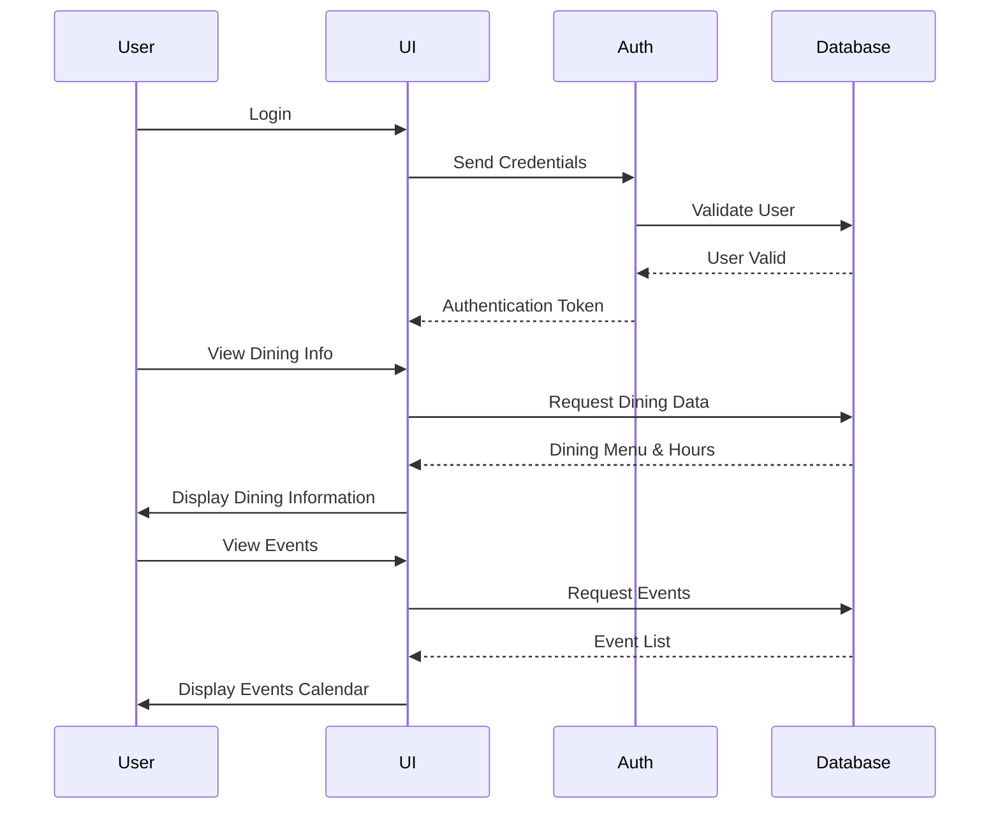

# Integration Testing Strategy

## Overview

Integration tests verify that different modules of the CollegeHelp platform work together as expected. These tests focus on the interactions between components, ensuring that data flows correctly between modules and that the system functions as a cohesive whole to provide reliable college information and resources to students.

## Key Integration Points



## Critical Integration Scenarios

### Authentication & Access Control

| Scenario | Description | Priority |
|----------|-------------|----------|
| User Registration to Profile Creation | Verify that after registration, a user profile is properly created | High |
| Login to Full Service Access | Verify that after login, users can access all service information | Critical |
| Guest Access to Limited Content | Verify that guest users can access basic information with appropriate restrictions | Critical |

### Information Service Integration

| Scenario | Description | Priority |
|----------|-------------|----------|
| Dining Menu Display | Verify that dining information is properly displayed with correct details and hours | High |
| Residence Information Access | Verify that residence details and maintenance request forms work properly | Critical |
| Event Calendar Integration | Verify that events are properly displayed with correct dates, times, and details | High |

### Notifications & Updates

| Scenario | Description | Priority |
|----------|-------------|----------|
| College Announcement Display | Verify that announcements appear on the dashboard with proper formatting | Medium |
| Notification Counting | Verify that unread notification count is accurately tracked and displayed | Medium |
| Profile Menu Integration | Verify that profile information and settings are properly connected to user accounts | Medium |

## Testing Approach

### Test Data Management

For integration testing, we maintain:
1. **Test Database** - Populated with known test data for college information
2. **Mock Firebase Services** - For authentication and data storage
3. **Test User Accounts** - With various access levels including guest access

### Integration Test Environment



## Test Implementation Example

```dart
void main() {
  IntegrationTestWidgetsFlutterBinding.ensureInitialized();

  group('Authentication to Home Integration', () {
    testWidgets('User can log in and view college information', (WidgetTester tester) async {
      // Launch the app
      app.main();
      await tester.pumpAndSettle();

      // Login
      await tester.tap(find.byKey(Key('loginButton')));
      await tester.pumpAndSettle();
      await tester.enterText(find.byKey(Key('emailField')), 'test@mail.utoronto.ca');
      await tester.enterText(find.byKey(Key('passwordField')), 'password123');
      await tester.tap(find.byKey(Key('loginButton')));
      await tester.pumpAndSettle();

      // Verify we're on the home screen
      expect(find.text('Welcome to New College'), findsOneWidget);
      
      // Navigate to dining tab
      await tester.tap(find.byIcon(Icons.restaurant));
      await tester.pumpAndSettle();
      
      // Verify dining information is displayed
      expect(find.text('Dining Hall Hours'), findsOneWidget);
      expect(find.text('Today\'s Menu'), findsOneWidget);
      
      // Navigate to residence tab
      await tester.tap(find.byIcon(Icons.apartment));
      await tester.pumpAndSettle();
      
      // Verify residence information is displayed
      expect(find.text('Residence Information'), findsOneWidget);
      expect(find.text('Maintenance Request'), findsOneWidget);
    });
  });
}
```

## Integration with Backend Services

For testing integration with backend services, we use:

1. **Mock Firebase** - For simulating authentication and database responses
2. **Test Environment** - Separate from production
3. **Data Seeding** - For consistent test data of college information

## Integration Test Data Flows



## Best Practices

1. **Isolation**: Each test should be independent of others
2. **Reset State**: Clean up all test data between test runs
3. **Realistic Scenarios**: Tests should model real user workflows
4. **Error Handling**: Test both happy paths and error cases
5. **Performance**: Monitor test execution time to detect slowdowns

## Continuous Improvement

- Regular review of integration test coverage
- Addition of new tests for discovered edge cases
- Performance optimization of slow-running tests
- Monitoring of flaky tests that pass/fail inconsistently 