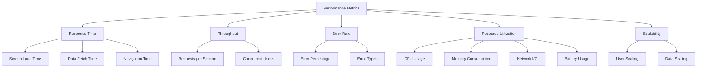
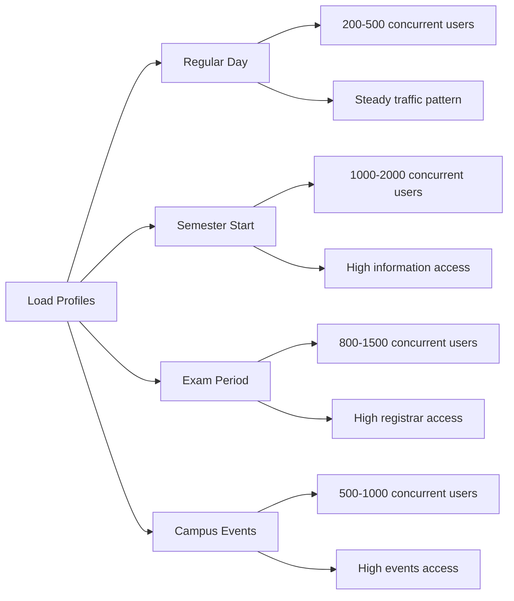
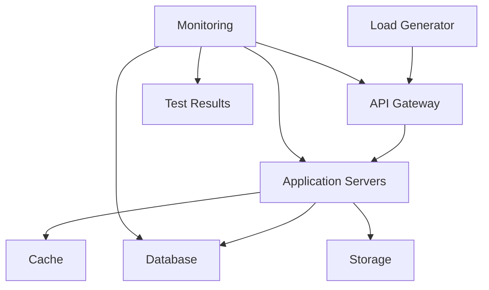
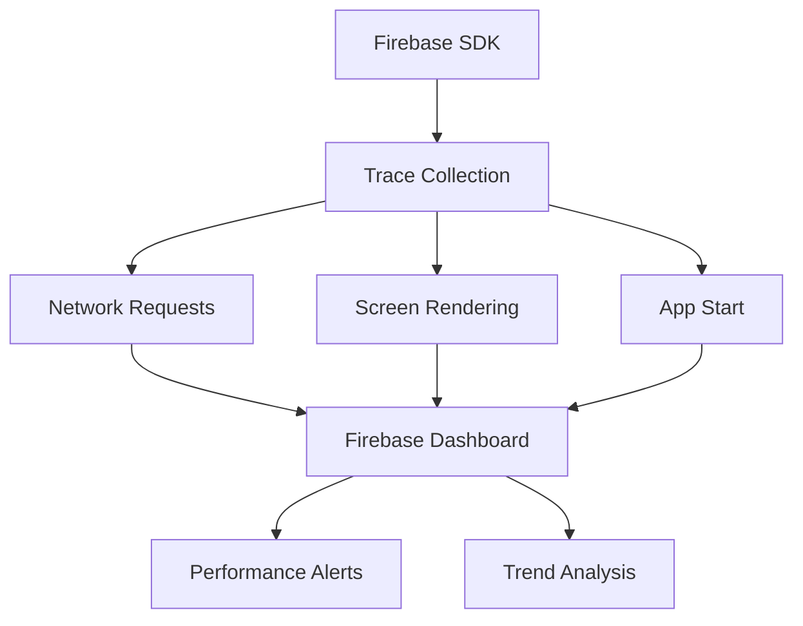

# Performance and Load Testing Strategy

## Overview

Performance and load testing ensure that the CollegeHelp platform can handle high user traffic while maintaining acceptable response times and system stability. These tests are critical for an educational application that will serve thousands of New College students, especially during peak usage periods like the beginning of semesters, exam weeks, and special campus events.

## Key Performance Metrics



## Performance Testing Types

| Test Type | Description | Key Metrics | When to Run |
|-----------|-------------|------------|------------|
| Load Testing | Gradually increase load to target level | Response time, error rate | After significant changes |
| Stress Testing | Push system beyond expected capacity | Breaking point, failure mode | Monthly |
| Endurance Testing | Sustained load over extended period | Memory leaks, degradation | Quarterly |
| Spike Testing | Sudden increase in user traffic | Recovery time, error handling | Before major events |
| Volume Testing | Testing with large data volumes | Data processing performance | When data structure changes |

## Critical Scenarios to Test

### Student Workflows

| Scenario | Description | Success Criteria | Priority |
|----------|-------------|------------------|----------|
| Semester Start | Simulate thousands of students accessing information simultaneously | < 3s response time, < 1% error rate | Critical |
| Event Announcements | Test system response when new college announcements are published | All notifications delivered, < 2s response time | Critical |
| Dining Information Access | Measure performance when many students check dining menus at meal times | < 2s response time, < 0.5% error rate | High |
| Residence Information | Simulate peak access to residence information and maintenance requests | All information accessible, < 3s response time | High |

### System Operations

| Scenario | Description | Success Criteria | Priority |
|----------|-------------|------------------|----------|
| Content Updates | Measure system response when updating content across the application | Updates visible within 5 seconds | Medium |
| Push Notifications | Send notifications to thousands of users | All notifications delivered within 5 minutes | Medium |
| Media Content Loading | Test loading of images and media across the application | Media loads within 3 seconds | Medium |
| Search Operations | Test search functionality under load | Results returned in < 2s | High |

## Load Profiles



## Performance Testing Tools

1. **JMeter** - For HTTP request load testing
2. **Locust** - For user behavior simulation
3. **Firebase Performance Monitoring** - For mobile app performance
4. **Flutter DevTools** - For app performance profiling
5. **Lighthouse** - For web performance metrics if web version exists

## Test Implementation Example

```python
# Locust load test configuration for CollegeHelp app
from locust import HttpUser, task, between

class StudentUser(HttpUser):
    wait_time = between(1, 5)
    
    def on_start(self):
        # Log in before starting tests
        response = self.client.post("/api/auth/login", {
            "email": f"test_user_{self.user_id}@mail.utoronto.ca",
            "password": "password123"
        })
        self.token = response.json()["token"]
        self.headers = {"Authorization": f"Bearer {self.token}"}
    
    @task(3)
    def view_home_dashboard(self):
        self.client.get("/api/announcements", headers=self.headers)
        self.client.get("/api/quick-links", headers=self.headers)
    
    @task(2)
    def view_dining_info(self):
        self.client.get("/api/dining/menu/today", headers=self.headers)
        self.client.get("/api/dining/hours", headers=self.headers)
    
    @task(2)
    def view_residence_info(self):
        self.client.get("/api/residence/information", headers=self.headers)
        self.client.get("/api/residence/contacts", headers=self.headers)
    
    @task(1)
    def view_events(self):
        self.client.get("/api/events/upcoming", headers=self.headers)
```

## Performance Test Environment



## Baseline Performance Expectations

| Component | Expected Response Time | Maximum Load | Error Threshold |
|-----------|------------------------|--------------|----------------|
| API Endpoints | < 200ms | 50 req/sec | < 0.1% |
| Screen Load | < 2s | - | < 0.5% |
| Database Queries | < 100ms | - | < 0.1% |
| Image Loading | < 3s for images | - | < 1% |
| Search Operations | < 500ms | - | < 0.5% |

## Mobile App Performance Testing

For the Flutter application, we specifically test:

1. **App Launch Time** - Should be < 2s on mid-range devices
2. **Screen Transition Time** - Should be < 300ms between screens
3. **Memory Usage** - Should not exceed 100MB during normal usage
4. **Battery Consumption** - < 3% battery per hour of active usage
5. **Network Efficiency** - Minimize data usage through caching and compression

## Firebase Performance Monitoring



## Best Practices

1. **Realistic Data** - Use production-like data volumes and patterns
2. **Isolated Environment** - Conduct tests in an environment that doesn't affect production
3. **Regular Baselines** - Establish and update performance baselines regularly
4. **End-to-End Monitoring** - Monitor all system components during tests
5. **Device Testing** - Test on both high-end and budget devices

## Common Performance Issues and Solutions

| Issue | Detection Method | Potential Solutions |
|-------|-----------------|---------------------|
| Slow API Responses | Response time monitoring | API optimization, caching, asynchronous processing |
| Excessive Network Requests | Network monitoring | Batch requests, caching, request consolidation |
| Memory Leaks | Memory profiling during endurance testing | Fix memory management, widget disposal, stream closures |
| Slow Screen Transitions | UI timeline analysis | Optimize widget tree, use const widgets, lazy loading |
| High Battery Usage | Battery consumption tests | Reduce background processing, optimize network calls |

## Continuous Improvement

- Automated performance regression testing in CI pipeline
- Regular performance reviews with development team
- Performance budgets for new features
- Monitoring of real user metrics (RUM) to identify issues 