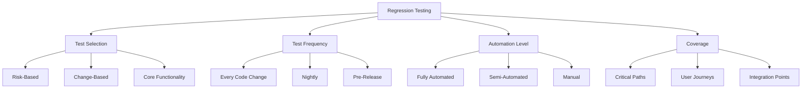
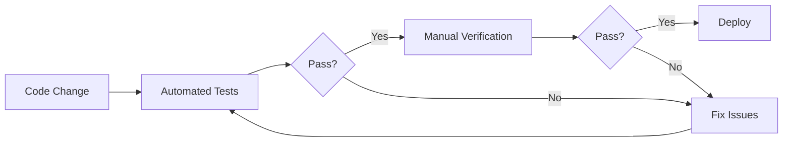
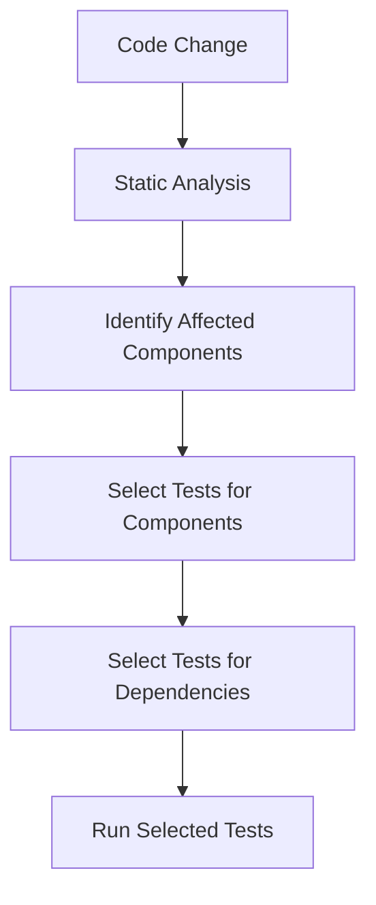
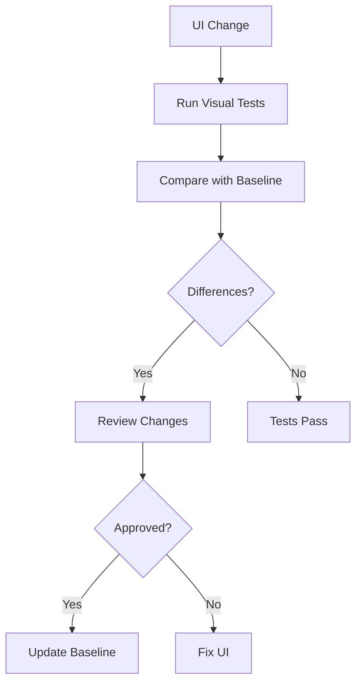

# Regression Testing Strategy

## Overview

Regression testing ensures that new code changes do not adversely affect existing functionality in the CollegeHelp platform. This is particularly important for an educational application where students rely on consistent functionality for their learning activities. This document outlines our approach to regression testing to maintain high quality and reliability.

## Regression Testing Principles



## Regression Test Suite Organization

Our regression test suite is organized into several tiers based on importance and execution frequency:

### Test Tiers

| Tier | Description | Execution Frequency | Coverage |
|------|-------------|---------------------|----------|
| Smoke Tests | Basic functionality verification | Every commit | Core features |
| Critical Path Tests | Key user journeys | Daily | Main user flows |
| Full Regression | Comprehensive test suite | Weekly/Pre-release | All features |

## Critical Regression Test Areas

### Authentication and User Management

| Test Area | Test Cases | Priority |
|-----------|------------|----------|
| Login/Logout | User can log in with valid credentials, cannot log in with invalid credentials, can log out successfully | Critical |
| Account Management | User can update profile, change password, manage notification settings | High |
| Permission Verification | Different user roles have appropriate access to features | Critical |

### Course Management

| Test Area | Test Cases | Priority |
|-----------|------------|----------|
| Course Creation | Instructors can create courses with all required elements | Critical |
| Content Management | Course content can be added, edited, and removed | High |
| Enrollment | Students can enroll in courses, view enrolled courses | Critical |

### Assessment System

| Test Area | Test Cases | Priority |
|-----------|------------|----------|
| Quiz Creation | Instructors can create quizzes with various question types | Critical |
| Quiz Taking | Students can take quizzes, submit answers, see results | Critical |
| Grade Calculation | Grades are calculated correctly based on assessment results | Critical |

## Regression Testing Approach



## Test Implementation Example

```dart
// Example of Flutter widget test for login functionality regression
testWidgets('Login regression test', (WidgetTester tester) async {
  // Build the login screen widget
  await tester.pumpWidget(MaterialApp(
    home: LoginScreen(),
  ));

  // Verify initial state
  expect(find.text('Login'), findsOneWidget);
  expect(find.byKey(Key('loginButton')), findsOneWidget);
  expect(find.byKey(Key('forgotPasswordButton')), findsOneWidget);
  
  // Test with empty fields - should show validation errors
  await tester.tap(find.byKey(Key('loginButton')));
  await tester.pumpAndSettle();
  expect(find.text('Email is required'), findsOneWidget);
  expect(find.text('Password is required'), findsOneWidget);
  
  // Enter valid email but invalid password
  await tester.enterText(find.byKey(Key('emailField')), 'test@example.com');
  await tester.enterText(find.byKey(Key('passwordField')), 'wrong');
  await tester.tap(find.byKey(Key('loginButton')));
  await tester.pumpAndSettle();
  expect(find.text('Invalid credentials'), findsOneWidget);
  
  // Enter valid credentials
  await tester.enterText(find.byKey(Key('emailField')), 'test@example.com');
  await tester.enterText(find.byKey(Key('passwordField')), 'password123');
  await tester.tap(find.byKey(Key('loginButton')));
  await tester.pumpAndSettle();
  
  // Verify successful login - should navigate to dashboard
  expect(find.text('Dashboard'), findsOneWidget);
  expect(find.text('Welcome back'), findsOneWidget);
  
  // Test logout functionality
  await tester.tap(find.byKey(Key('userMenuButton')));
  await tester.pumpAndSettle();
  await tester.tap(find.text('Logout'));
  await tester.pumpAndSettle();
  
  // Verify we're back at login screen
  expect(find.text('Login'), findsOneWidget);
});
```

## Regression Test Selection Strategies

As the application grows, running all tests for every change becomes impractical. We use these strategies to select which tests to run:

### Change-Based Selection



### Risk-Based Selection

| Feature Area | Risk Level | Selection Strategy |
|--------------|------------|-------------------|
| Authentication | High | Run all tests on every change |
| Course Content | Medium | Run tests when content or rendering components change |
| User Interface | Medium | Run visual regression tests on UI changes |
| Analytics | Low | Run weekly or before releases |

## Visual Regression Testing

For UI components, we use visual regression testing to catch unintended visual changes:

1. **Baseline Screenshots**: Capture approved UI states
2. **Comparison**: Compare new screenshots with baselines
3. **Approval Process**: Review and approve intentional changes



## Mobile App Regression Testing

For the Flutter mobile application, we perform additional regression testing:

1. **Platform-Specific Testing**: Test on both iOS and Android
2. **Device Matrix**: Test on various device sizes and OS versions
3. **Orientation Testing**: Verify functionality in both portrait and landscape
4. **Offline Mode**: Verify offline functionality still works

## Database Schema Changes

When database schema changes occur:

1. **Migration Testing**: Test data migration scripts
2. **Data Integrity**: Verify no data is lost or corrupted
3. **Performance**: Check query performance with migrated data

## Regression Test Metrics

We track the following metrics to assess our regression testing effectiveness:

| Metric | Target | Measurement Method |
|--------|--------|-------------------|
| Regression Coverage | >90% of critical paths | Coverage analysis |
| Regression Test Pass Rate | >98% | Test results analysis |
| Regression Defect Escape Rate | <2% | Defects found in production |
| Execution Time | <2 hours for full suite | Test run timing |

## Handling Flaky Tests

Flaky tests (those that pass/fail inconsistently) can reduce trust in the regression suite. We handle them by:

1. **Identification**: Tag and track flaky tests
2. **Quarantine**: Move consistently flaky tests to a separate suite
3. **Investigation**: Systematically identify and fix root causes
4. **Reintroduction**: Only reintroduce tests after confirming stability

## Regression Testing Schedule

| Test Suite | Trigger | Environment | Notification |
|------------|---------|-------------|-------------|
| Smoke Tests | Every commit | CI pipeline | Immediate to committer |
| Critical Path Tests | Daily | Test environment | Daily report to team |
| Full Regression | Weekly, Pre-release | Staging environment | Comprehensive report |

## Best Practices

1. **Maintain Test Data**: Keep test data current and representative
2. **Atomic Tests**: Each test should be independent of others
3. **Clear Purpose**: Each test should have a clear objective
4. **Descriptive Names**: Test names should describe what is being tested
5. **Fast Execution**: Optimize tests for speed without sacrificing quality

## Continuous Improvement

- Regular review of test coverage and effectiveness
- Pruning of redundant or low-value tests
- Addition of tests for new features and found bugs
- Performance optimization of slow tests 