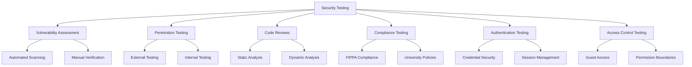
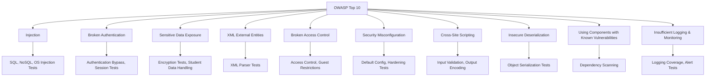
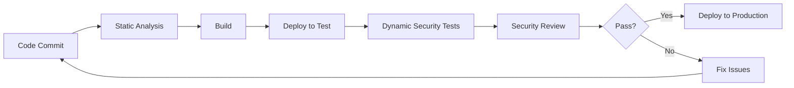

# Security Testing Strategy

## Overview

Security testing is critical for the CollegeHelp platform as it handles sensitive student information, authentication credentials, and college service data. Our comprehensive security testing strategy aims to identify vulnerabilities, prevent data breaches, and ensure compliance with relevant educational institution and data protection regulations.

## Security Testing Approach



## Key Security Concerns

### Student Data Protection

| Security Concern | Testing Method | Priority |
|------------------|----------------|----------|
| Student Profile Information | Data encryption verification, access control testing | Critical |
| Authentication Credentials | Password security testing, secure storage verification | Critical |
| Session Management | Session timeout testing, token security | Critical |
| Notification Data | Authorization testing, secure data handling | High |

### Authentication & Access Control

| Security Concern | Testing Method | Priority |
|------------------|----------------|----------|
| Password Security | Password policy testing, brute force protection | Critical |
| Guest Access Limitations | Boundary testing, access control verification | High |
| Session Management | Token validation, timeout testing | Critical |
| Firebase Authentication | Security configuration verification | Critical |

### Application Security

| Security Concern | Testing Method | Priority |
|------------------|----------------|----------|
| Input Validation | Injection testing (SQL, XSS, CSRF) | Critical |
| API Security | API endpoint security testing, rate limiting | Critical |
| Mobile App Security | App permission testing, secure storage | High |
| Information Integrity | Data validation testing | High |

## Security Testing Tools

1. **OWASP ZAP** - For web application vulnerability scanning
2. **SonarQube** - For static code analysis
3. **Firebase Security Rules Testing** - For database security verification
4. **MobSF** - For mobile application security testing
5. **Dependency Check** - For third-party library vulnerability scanning

## OWASP Top 10 Testing Coverage



## Test Implementation Example

```python
# Example of an authentication security test using OWASP ZAP API
import time
from zapv2 import ZAPv2

# Setup ZAP connection
zap = ZAPv2(apikey='api-key-here', proxies={'http': 'http://localhost:8080', 'https': 'http://localhost:8080'})

target = 'https://staging-collegehelp.utoronto.ca'
zap.urlopen(target)
time.sleep(2)

# Spider the target to discover endpoints
print('Spidering target: ' + target)
scan_id = zap.spider.scan(target)
time.sleep(2)

# Wait for spider to complete
while int(zap.spider.status(scan_id)) < 100:
    print('Spider progress: ' + zap.spider.status(scan_id) + '%')
    time.sleep(5)

print('Spider completed')

# Perform active scan to find vulnerabilities
print('Active scanning target: ' + target)
scan_id = zap.ascan.scan(target)

# Wait for active scan to complete
while int(zap.ascan.status(scan_id)) < 100:
    print('Active scan progress: ' + zap.ascan.status(scan_id) + '%')
    time.sleep(5)

print('Active scan completed')

# Get vulnerabilities
alerts = zap.core.alerts(target)
for alert in alerts:
    print('Alert: ' + alert.get('alert') + ' at URL: ' + alert.get('url'))
```

## Security Test Scenarios

### Authentication Testing

1. **Credential Testing**
   - Attempt login with weak passwords
   - Test password policy enforcement
   - Verify account lockout after multiple failures

2. **Session Management**
   - Test session timeout functionality
   - Attempt session hijacking
   - Test concurrent session handling

3. **Guest Access**
   - Verify access limitations for guest users
   - Test conversion from guest to authenticated user
   - Ensure sensitive information is not exposed to guests

### Access Control Testing

1. **Role-Based Access**
   - Test authenticated vs. guest access
   - Verify admin function restrictions if applicable
   - Test horizontal access controls (one student accessing another's data)

2. **API Authorization**
   - Test API endpoints with missing tokens
   - Attempt access with expired tokens
   - Test API rate limiting and throttling

### Data Protection Testing

1. **Data in Transit**
   - Verify TLS implementation
   - Test for SSL/TLS vulnerabilities
   - Verify certificate validation

2. **Data at Rest**
   - Verify Firebase database security rules
   - Test secure local storage
   - Verify student information protection mechanisms

## Compliance Testing

For university applications, compliance with regulations is critical:

| Regulation | Testing Approach | Key Requirements |
|------------|------------------|------------------|
| FIPPA (Ontario) | Audit access logs, verify data handling | Student privacy protection, data disclosure controls |
| University Policies | Verify compliance with UofT security policies | Authentication standards, data handling |
| Firebase Rules | Test Firebase security rules effectiveness | Data access restrictions, rule coverage |
| App Store Requirements | Verify compliance with Apple/Google requirements | Data collection transparency, permission usage |

## Security Testing in the CI/CD Pipeline



## Security Testing Schedule

| Test Type | Frequency | Responsibility | Reporting |
|-----------|-----------|----------------|-----------|
| Automated Scans | Daily | DevOps | Automatic alerts for critical issues |
| Dependency Checks | Weekly | Development | Weekly vulnerability report |
| Penetration Testing | Quarterly | Security Team/External | Detailed findings report |
| Security Code Review | For major features | Security Team | Pre-release security sign-off |
| Full Security Audit | Annually | External Security Firm | Comprehensive security assessment |

## Best Practices

1. **Shift Left** - Integrate security testing early in the development cycle
2. **Depth in Defense** - Multiple layers of security testing
3. **Realistic Testing** - Simulate real attack scenarios
4. **Continuous Monitoring** - Security testing is not a one-time activity
5. **Security Training** - Ensure developers understand security principles

## Incident Response Testing

Security testing should also include verification of incident response procedures:

1. **Breach Detection** - Test ability to detect security breaches
2. **Containment Procedures** - Verify system isolation capabilities
3. **Data Recovery** - Test backup and restoration procedures
4. **Notification Process** - Verify user notification mechanisms
5. **Post-Incident Analysis** - Document lessons learned 