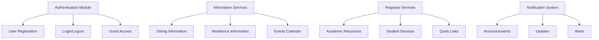

# Unit Testing Strategy

## Overview

Unit tests validate individual components in isolation to ensure the correct behavior of core functions and modules. For the CollegeHelp platform, unit tests focus on business logic, data transformations, and utility functions that support the New College UofT student resource application.

## Critical Components for Unit Testing



## Key Functions to Test

### Authentication & User Management

| Function | Test Priority | Rationale |
|----------|--------------|-----------|
| `userRegistration()` | Critical | Ensures new users can be properly added to the system |
| `loginUser()` | Critical | Validates credentials and establishes user sessions |
| `guestAccess()` | High | Controls limited access for non-authenticated users |
| `passwordReset()` | High | Critical for account recovery |

### Information Services

| Function | Test Priority | Rationale |
|----------|--------------|-----------|
| `fetchDiningMenus()` | High | Core functionality for dining information |
| `getResidenceDetails()` | High | Ensures residence information is correctly displayed |
| `loadEventsCalendar()` | Medium | Tests event listing and filtering |
| `retrieveAnnouncements()` | High | Critical for displaying important college updates |

### Registrar Services

| Function | Test Priority | Rationale |
|----------|--------------|-----------|
| `getAcademicResources()` | High | Core functionality for academic support |
| `accessStudentServices()` | High | Ensures access to key student services |
| `loadQuickLinks()` | Medium | Tests proper loading of frequently used links |
| `displayContactInfo()` | Medium | Ensures proper display of contact information |

### UI Components

| Function | Test Priority | Rationale |
|----------|--------------|-----------|
| `buildHomeTab()` | High | Core dashboard display functionality |
| `renderNotifications()` | High | Ensures notifications are properly displayed |
| `displayProfileInfo()` | Medium | Tests user profile information display |
| `navigationControls()` | Critical | Ensures proper navigation between app sections |

## Testing Tools and Framework

For the Flutter application, we use the following testing tools:

1. **Flutter Test Framework** - Primary tool for writing and running unit tests
2. **Mockito** - For creating mock objects to test components in isolation
3. **Bloc Test** - For testing Bloc state management components
4. **Coverage** - For measuring test coverage

## Test Implementation Example

```dart
void main() {
  group('Authentication Tests', () {
    late AuthService authService;
    late MockFirebaseAuth mockFirebaseAuth;
    
    setUp(() {
      mockFirebaseAuth = MockFirebaseAuth();
      authService = AuthService(auth: mockFirebaseAuth);
    });
    
    test('login with valid credentials should succeed', () async {
      // Arrange
      when(mockFirebaseAuth.signInWithEmailAndPassword(
        email: 'test@mail.utoronto.ca',
        password: 'password123',
      )).thenAnswer((_) async => MockUserCredential());
      
      // Act
      final result = await authService.loginUser(
        email: 'test@mail.utoronto.ca',
        password: 'password123',
      );
      
      // Assert
      expect(result.success, true);
      expect(result.error, isNull);
    });
    
    test('login with invalid credentials should fail', () async {
      // Arrange
      when(mockFirebaseAuth.signInWithEmailAndPassword(
        email: 'test@mail.utoronto.ca',
        password: 'wrongpassword',
      )).thenThrow(FirebaseAuthException(code: 'wrong-password'));
      
      // Act
      final result = await authService.loginUser(
        email: 'test@mail.utoronto.ca',
        password: 'wrongpassword',
      );
      
      // Assert
      expect(result.success, false);
      expect(result.error, isNotNull);
    });
    
    test('guest access should provide limited functionality', () async {
      // Arrange
      final homeScreen = HomeScreen(isGuest: true);
      
      // Act
      final result = authService.getAccessLevel(homeScreen);
      
      // Assert
      expect(result, AccessLevel.guest);
      expect(result.canAccessFullContent, false);
    });
  });
}
```

## Best Practices

1. Follow the **Arrange-Act-Assert** pattern for test structure
2. Test both valid and invalid scenarios
3. Use descriptive test names that explain the expected behavior
4. Keep unit tests focused on testing a single unit of functionality
5. Aim for fast execution to enable frequent running during development

## Continuous Improvement

Unit test coverage should increase over time, with new tests written for:
- Bug fixes (to prevent regression)
- New features (to ensure correct implementation)
- Complex logic refactoring (to verify equivalent behavior) 