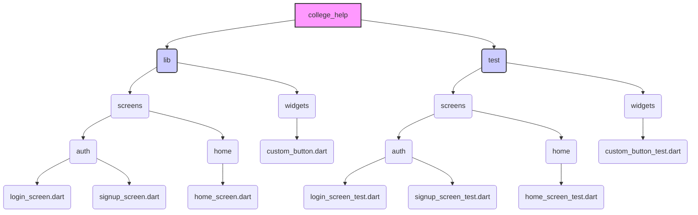

# Widget Testing Guidelines

This document provides guidelines and instructions for writing and running widget tests for the New College UofT mobile application.

## Overview

Widget tests in Flutter allow you to test individual widgets or screens in isolation from the full application. They run faster than integration tests and provide a good balance between unit testing pure logic and testing the full UI flow.

The primary type of test used in this project currently is **widget testing**.

## Test Directory Structure

Widget tests should reside in the `college_help/test/` directory. The structure within `test/` should **mirror** the structure of the `college_help/lib/` directory to make tests easy to locate.



Example:
- Tests for `lib/screens/auth/login_screen.dart` go in `test/screens/auth/login_screen_test.dart`.
- Tests for `lib/widgets/custom_button.dart` go in `test/widgets/custom_button_test.dart`.

## Writing Widget Tests

Widget tests verify that a widget's UI looks and behaves as expected. The general flow is:

```mermaid
graph LR
    A[Start] --> B{Setup};
    B --> C{Find Widgets};
    C --> D{Interact};
    D --> E{Pump Frame(s)};
    E --> F{Assert State};
    F --> G[End];
    
    subgraph Test Cycle
        direction LR
        B --> C --> D --> E --> F
    end

    style B fill:#ccf,stroke:#333,stroke-width:2px
    style C fill:#cdf,stroke:#333,stroke-width:2px
    style D fill:#cdf,stroke:#333,stroke-width:2px
    style E fill:#cfc,stroke:#333,stroke-width:2px
    style F fill:#fcc,stroke:#333,stroke-width:2px
```

1.  **Setup**: Import necessary packages (`flutter_test`, `flutter`, your widget's file). Use `tester.pumpWidget()` to build your widget. Crucially, wrap screen-level widgets or widgets requiring navigation/theming in `MaterialApp` to provide the necessary context (like `Navigator`, `Theme`).
    ```dart
    await tester.pumpWidget(MaterialApp(home: MyScreen()));
    ```
2.  **Find**: Use `find` methods (e.g., `find.text()`, `find.byType()`, `find.byKey()`, `find.byIcon()`, `find.widgetWithText()`, `find.descendant()`) to locate specific widgets within the rendered tree.
    ```dart
    final buttonFinder = find.widgetWithText(ElevatedButton, 'Submit');
    ```
3.  **Interact**: Use `tester` methods (e.g., `tester.tap()`, `tester.enterText()`, `tester.drag()`, `tester.ensureVisible()`) to simulate user actions on the found widgets.
    ```dart
    await tester.tap(buttonFinder);
    ```
4.  **Pump**: After interactions that trigger state changes or animations, use `tester.pump()` or related methods to advance the test clock and allow the UI to rebuild or animations to progress.
    *   `pump()`: Advances by one frame or a specified duration. Use this when `pumpAndSettle` might time out (e.g., due to repeating animations) or when you need precise frame control. You might need multiple `pump()` calls or a `pump()` with a specific `Duration`.
    *   `pumpAndSettle()`: Repeatedly calls `pump()` until no more frames are scheduled. Ideal for waiting for finite animations or futures, but **avoid** if infinite animations are present, as it will time out.
    *   **Looped Pump (for tricky animations):** When `pumpAndSettle` times out and simple `pump(duration)` is unreliable, you can pump in a loop, checking the desired state after each small interval until it's met or a timeout occurs (see `home_screen_test.dart` for an example).
    ```dart
    await tester.pump(); // Advance one frame
    await tester.pump(const Duration(milliseconds: 500)); // Advance 500ms
    await tester.pumpAndSettle(); // Wait for animations (if safe)
    ```
5.  **Assert**: Use `expect()` with `Matcher`s (e.g., `findsOneWidget`, `findsNothing`, `isTrue`, `isFalse`) to verify that the UI state matches expectations after the interaction and pumping.
    ```dart
    expect(find.text('Success!'), findsOneWidget);
    ```

## Example Widget Test (WelcomeScreen)

This example tests that the `WelcomeScreen` displays key elements.

```dart
// Located in: test/screens/welcome_screen_test.dart

import 'package:flutter/material.dart';
import 'package:flutter_test/flutter_test.dart';
import 'package:college_help/screens/welcome_screen.dart'; // Import the widget
// Other necessary imports for LoginScreen, SignUpScreen etc. if testing navigation

void main() {
  testWidgets('WelcomeScreen displays logo, text, and buttons', (WidgetTester tester) async {
    // Setup: Pump the widget within MaterialApp
    await tester.pumpWidget(const MaterialApp(home: WelcomeScreen()));

    // Find: Locate widgets
    final iconFinder = find.byIcon(Icons.school);
    final titleFinder = find.text('Welcome to New College');
    final loginButtonFinder = find.widgetWithText(ElevatedButton, 'Login');
    final signupButtonFinder = find.widgetWithText(OutlinedButton, 'Sign Up');
    final guestButtonFinder = find.widgetWithText(TextButton, 'Continue as Guest');

    // Assert: Verify widgets are present initially
    expect(iconFinder, findsOneWidget);
    expect(titleFinder, findsOneWidget);
    expect(loginButtonFinder, findsOneWidget);
    expect(signupButtonFinder, findsOneWidget);
    expect(guestButtonFinder, findsOneWidget);

    // Further tests in this file verify navigation logic by tapping buttons
    // using tester.tap() and checking for the presence of the target screen
    // using expect(find.byType(TargetScreen), findsOneWidget) after pumping.
  });
}
```

## Further Examples

- **Testing Scrolling (`DiningTab`):** The `test/screens/home/tabs/dining_tab_test.dart` file demonstrates how to test widgets within a `ListView`. Key techniques include:
    - Using `tester.scrollUntilVisible()` to bring specific widgets into view before asserting their presence.
    - Using `skipOffstage: false` with finders if you need to locate widgets that might exist in the list but aren't currently rendered on screen (though scrolling is often more reliable).
    - Potentially increasing the test screen size (`tester.view.physicalSize`) if initial layout fails, although `scrollUntilVisible` is generally preferred.

- **Testing AppBars and Drawers (`EnhancedAppBar`):** The `test/screens/home/components/app_bar/enhanced_app_bar_test.dart` shows:
    - Setting up and providing mock `AnimationController` instances (importantly, *not* starting repeating animations via `.repeat()` in `setUpAll` if the animation itself isn't being tested, and stopping the controller in `tearDown`).
    - Testing interactions that trigger drawer opening (`Scaffold.openEndDrawer()`) by using a `GlobalKey<ScaffoldState>` and verifying the drawer content appears after interaction and pumping.
    - Verifying custom badge content (finding the `Text` directly if a standard `Badge` widget isn't used).

## Running Tests

Run all tests from the `college_help` project root directory:

```bash
flutter test
```

Run tests in a specific file:

```bash
flutter test test/screens/welcome_screen_test.dart
```

Run tests within the `docs/testing` directory (if specific test runners are configured - assumes standard setup):

```bash
cd .. # Navigate up to college_help directory if currently in docs/testing
flutter test test/
```

## Key Considerations

- **Widget Dependencies:** Ensure widgets under test have necessary providers or context (like `MaterialApp`).
- **Animations:** Be mindful of animations. Use appropriate `pump` strategies (often `pump()` with duration or looped pump) if `pumpAndSettle()` times out.
- **Asset Loading:** Ensure any assets (images, fonts) used by the widget are declared in `pubspec.yaml` and available to the test environment. Run `flutter clean` if you encounter persistent asset loading errors after adding/modifying assets.
- **Focus:** Cover common user interactions, edge cases (e.g., form validation errors), and different widget states. 